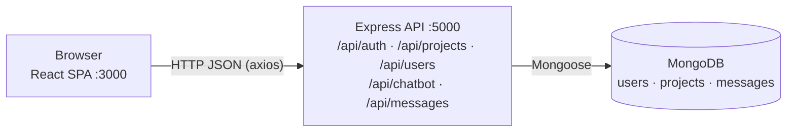
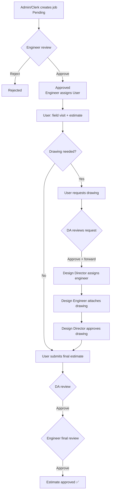

# CEMS — Civil Engineering Management System

CEMS is a web application for a provincial engineering organization. It tracks
civil-engineering jobs (construction and repair requests from government ministries and
departments) from registration through field estimate, structural drawing and final
estimate approval.

It has two sides, each with its own login portal:

| Portal | Units | Users |
|---|---|---|
| **Division** | 8 engineering divisions: Anuradhapura-East, Anuradhapura-West, Medawachchiya, Mihinthale, Kekirawa, Thambuttegama, Polonnaruwa, Hingurakgoda | Admin / Clerk, Division Engineer, Divisional Assistant (DA), User (field staff) |
| **Head Office** | Head Office + 5 branches: Design, Admin (`branch-a`), Accounts (`branch-b`), Works (`branch-c`), Procurements (`branch-d`) | Head Office admin, Branch Engineers, Branch Directors |

> **Full documentation:** [docs/PROJECT_DOCUMENTATION.md](docs/PROJECT_DOCUMENTATION.md)
> (architecture, every route and endpoint, data models, workflows, security, open questions).
> Risk scoring method: [docs/RISK_INTELLIGENCE.md](docs/RISK_INTELLIGENCE.md).

---

## Contents

- [Features](#features)
- [Tech stack](#tech-stack)
- [Architecture](#architecture)
- [Project structure](#project-structure)
- [Getting started](#getting-started)
- [Default accounts](#default-accounts)
- [User roles](#user-roles)
- [Job workflow](#job-workflow)
- [API overview](#api-overview)
- [Testing](#testing)
- [Deployment](#deployment)
- [Security notes](#security-notes)
- [Troubleshooting](#troubleshooting)
- [Contributing](#contributing)
- [Glossary](#glossary)

---

## Features

- **Job registration with official numbering.** Each job gets a unique Job No. (`JB-1234`)
  and an Estimation No. in the format `YY-DIV-DEPT-WORK-SERIAL` (e.g. `26-KEK-612-N-01`).
- **Division-scoped dashboards.** Engineers, DAs and users only see their own division's jobs.
- **Review pipeline.** Engineer approval → field visit and estimate → drawing request →
  DA review → Design branch drawing → final estimate → DA review → Engineer final review.
- **Job Tracking.** Every workflow step is recorded in a per-job timeline (`statusHistory`).
- **Risk Intelligence.** A rule-based 0–100 risk score for each job (LOW / MEDIUM / HIGH / CRITICAL).
- **CEMS AI Assistant.** A rule-based chatbot (not an LLM) that answers questions about a
  division's jobs: summaries, pending/overdue jobs, trends, risk, allocations and more.
- **Messaging.** One-to-one chat inside a division, with replies, attachments (up to 5 MB)
  and unread badges.
- **Reports and charts.** Recharts dashboards and PDF export (jsPDF).
- **Staff management.** Engineers add division staff; the Head Office assigns branch staff.
- **Personalization.** Light/dark mode, five accent themes, profile pictures with cropping, UI sounds.

---

## Tech stack

| Layer | Technologies |
|---|---|
| Frontend | React 18 (Create React App), React Router 6, axios, Recharts, jsPDF + jspdf-autotable, framer-motion, Tailwind CSS 3, lucide-react / react-icons / remixicon |
| Backend | Node.js, Express 5, Mongoose 9, bcryptjs, helmet, cors, compression, express-rate-limit, dotenv |
| Database | MongoDB |
| Tests | Jest (backend) |

---

## Architecture



- The frontend calls the API at a **hard-coded** ` https://pedncpgovlk.com` (or
  `http://localhost:5000/api`). There is no environment variable for it.
- There are no WebSockets. Dashboards poll for updates (unread messages every 4–6 s,
  the Admin dashboard's job data every 8 s).
- Files (drawings, attachments, profile pictures) are stored as base64 strings inside MongoDB.
- Notifications are generated in the browser from job data.

---

## Project structure

```text
software-engineering-project/
├── README.md
├── docs/
│   ├── PROJECT_DOCUMENTATION.md   Full technical documentation
│   └── RISK_INTELLIGENCE.md       Risk-scoring methodology
├── backend/
│   ├── server.js                  Entry point: middleware, rate limit, routes, error handler
│   ├── .env.example               Template for your own .env (copy it, then fill it in)
│   ├── seedDefaultUsers.js        Creates the 8 division engineers + 1 admin account
│   ├── resetPassword.js           Resets a user's password from the command line
│   ├── config/                    db.js (MongoDB connection), riskConfig.js (risk weights)
│   ├── controllers/               auth, project, risk, chatbot
│   ├── middleware/                authMiddleware.js (preventCache only)
│   ├── models/                    User, Project, Message
│   ├── routes/                    authRoutes, projectRoutes, userRoutes, messageRoutes, chatbotRoutes
│   ├── services/riskService.js    Pure risk-scoring functions
│   ├── utils/escapeRegex.js
│   └── tests/riskService.test.js
└── frontend/
    ├── public/
    └── src/
        ├── App.js                 All routes (dashboards are lazy-loaded)
        ├── api/                   axios instance
        ├── components/            ProtectedRoute, DivisionChat, JobTrackingTimeline,
        │                          RiskIntelligencePanel, NotificationCenter, ToastStack, ...
        ├── constants/branches.js
        ├── utils/                 jobTracking, notifications, formatCurrency, sounds, ...
        ├── styles/premium-system.css
        └── pages/
            ├── Portal.jsx              Home page with both portals
            ├── DivisionLogin.js        Division login
            ├── admin/  engineer/  user/  DivisionalAssistant/
            ├── HeadOffice/             Head Office login + dashboard
            ├── Design/                 Design Engineer / Director dashboards, JobDetails
            ├── BranchA/ … BranchD/     Branch Engineer / Director dashboards
            └── shared/
```

---

## Getting started

### Prerequisites

- **Node.js** (current LTS) and npm
- **MongoDB** (local server or hosted cluster such as MongoDB Atlas)
- **Git**

### 1. Clone the repository

```bash
git clone https://github.com/Project-Managment-System/software-engineering-project.git
cd software-engineering-project
```

### 2. Set up the backend

```bash
cd backend
npm install
```

Create your own `backend/.env` from the template [backend/.env.example](backend/.env.example):

```bash
cp .env.example .env        # Windows PowerShell: Copy-Item .env.example .env
```

Then open `.env` and fill in your own values. `.env` is git-ignored, so never commit it.

```env
MONGODB_URI=mongodb://127.0.0.1:27017/civilManagement
PORT=5000
JWT_SECRET=replace-with-a-long-random-string
```

| Variable | Required | Notes |
|---|---|---|
| `MONGODB_URI` | Yes | MongoDB connection string |
| `PORT` | No | Defaults to `5000`. **Keep it at 5000**, because the frontend has this port hard-coded |
| `JWT_SECRET` | No | Present in `.env` but not read by any code yet |

Start the API (there is no `npm start` script for the backend):

```bash
node server.js
# [CORE]: Server active on port 5000
```

### 3. Seed the default accounts

In a second terminal, from `backend/`:

```bash
node seedDefaultUsers.js
```

It is safe to re-run, because existing employee IDs are skipped. See [Default accounts](#default-accounts).

### 4. Set up the frontend

```bash
cd frontend
npm install
npm start          # opens http://localhost:3000
```

### 5. Log in

Open <http://localhost:3000>, choose the **Division** portal, and log in with an
**Employee ID** (not an email) and password, e.g. `cl0001` for the Admin/Clerk dashboard.

### Resetting a password

If a password is forgotten, run this from `backend/`:

```bash
node resetPassword.js <employeeId> <newPassword>
# e.g. node resetPassword.js enke1 ke1
```

### Available scripts

| Where | Command | What it does |
|---|---|---|
| backend | `node server.js` | Start the API |
| backend | `node seedDefaultUsers.js` | Create default accounts |
| backend | `node resetPassword.js <id> <pw>` | Reset a user's password |
| backend | `npm test` | Run Jest tests |
| frontend | `npm start` | Dev server on port 3000 |
| frontend | `npm run build` | Production build to `frontend/build/` |
| frontend | `npm test` | React test runner (no frontend tests exist yet) |

---

## Default accounts

Created by `seedDefaultUsers.js`. **These passwords are weak and are meant for development
only. Change them after the first login.**

| Employee ID | Password | Role | Division |
|---|---|---|---|
| `cl0001` | `cl1` | admin | — |
| `enae1` | `ae1` | engineer | Anuradhapura-East |
| `enaw1` | `aw1` | engineer | Anuradhapura-West |
| `enme1` | `me1` | engineer | Medawachchiya |
| `enmi1` | `mi1` | engineer | Mihinthale |
| `enth1` | `th1` | engineer | Thambuththegama ⚠️ |
| `enke1` | `ke1` | engineer | Kekirawa |
| `enpo1` | `po1` | engineer | Polonnaruwa |
| `enhi1` | `hi1` | engineer | Higurakgoda ⚠️ |

⚠️ These two division names are spelled differently from the rest of the app
(`Thambuttegama`, `Hingurakgoda`). Jobs are matched by exact division name, so fix the
user's `division` in the database if those engineers see no jobs.

**Other accounts:**
- Clerks, DAs and users are created by a Division Engineer (**Add User**).
- Branch engineers and directors are created by the Head Office admin (**Assign Staff**).
- `headoffice_admin` accounts have no seed script or endpoint. Insert them directly into MongoDB.

---

## User roles

| Role | Portal | Dashboard | Main responsibilities |
|---|---|---|---|
| `admin` / `clerk` | Division | `/admin/dashboard` | Create, edit and delete jobs |
| `engineer` (one per division) | Division | `/engineer/dashboard` | Approve/reject jobs, assign users, final estimate review, manage staff, Risk Intelligence, chatbot |
| `division_assistant` | Division | `/divisional-assistant/dashboard` | Review drawing requests and final estimates, forward to Design |
| `user` | Division | `/user/dashboard` | Field visit, field estimate, drawing request, final estimate |
| `headoffice_admin` | Head Office | `/headoffice/dashboard` | Manage branch staff, view all records |
| `branch_director` (one per branch) | Head Office | `/<branch>/director/dashboard` | Design: assign Design Engineers, approve drawings |
| `branch_engineer` | Head Office | `/<branch>/engineer/dashboard` | Design: attach drawings (can recall before approval) |

Branches A–D dashboards are currently read-only (overview charts, all records, settings).

---

## Job workflow



Most review steps can be undone by the reviewer. Every step is added to the job's
**Job Tracking** timeline.

### Risk Intelligence

Each job is scored 0–100 from five weighted factors:

| Factor | Weight |
|---|---|
| Days pending | 30% |
| Staleness (time since last update) | 25% |
| Missing drawing | 15% |
| Previous rejection | 15% |
| Allocation vs. DS-division average | 15% |

Levels: **LOW** ≤ 24 · **MEDIUM** ≤ 49 · **HIGH** ≤ 74 · **CRITICAL** ≤ 100. If a factor
can't be computed, it is dropped and the remaining weights are rescaled. Details:
[docs/RISK_INTELLIGENCE.md](docs/RISK_INTELLIGENCE.md).

---

## API overview

Base URL: `http://localhost:5000/api`. All requests and responses are JSON.

| Area | Endpoints |
|---|---|
| Auth | `POST /auth/login` (rate-limited: 30 requests / 15 min / IP) |
| Projects | `POST /projects/add` · `GET /projects/all` · `GET /projects/division/:division` · `GET /projects/job/:jobNo` · `PUT /projects/update/:jobNo` · `PATCH /projects/status/:jobNo` · `PATCH /projects/assign/:jobNo` · `PATCH /projects/undo/:jobNo` · `PATCH /projects/undo-engineer-review/:jobNo` · `DELETE /projects/delete/:jobNo` |
| Risk | `GET /projects/risk/summary?division=` · `GET /projects/risk/:jobNo` |
| Users | `POST /users/add` · `POST /users/branch-add` · `GET /users` · `GET /users/division/:division` · `GET /users/:id` · `PUT /users/:id` · `PATCH /users/:id/profile` · `PATCH /users/:id/password` · `DELETE /users/:id` |
| Messages | `POST /messages` · `GET /messages/unread/:userId` · `GET /messages/conversations/:userId` · `GET /messages/:userId1/:userId2` · `PUT /messages/read/:senderId/:recipientId` · `DELETE /messages/:messageId?userId=` |
| Chatbot | `POST /chatbot/query` with `{ message, division }` |

Request bodies, responses and error codes are listed in
[section 11 of the full documentation](docs/PROJECT_DOCUMENTATION.md#11-backend-api-reference).

---

## Testing

```bash
cd backend
npm test
```

The backend tests cover the risk engine ([riskService.test.js](backend/tests/riskService.test.js)).

**Current status (2026-10-06): 10 passed, 2 failed, 1 todo.** The two failing tests
(*scenario 1: low-risk* and *scenario 2: medium-risk*) call `computeProjectRisk()` without
the fixed `NOW` date, so their expected levels drift as real time passes. The fix is to
pass `NOW` as the third argument.

There are no frontend tests yet.

---

## Deployment

No Docker, CI or hosting configuration is in the repository yet. To deploy manually:

1. Provide a reachable MongoDB instance and set `MONGODB_URI`.
2. Backend: `npm install --production && node server.js` (it listens on `0.0.0.0:$PORT`).
   Use a process manager such as pm2 to keep it running.
3. Frontend: `npm run build`, then serve `frontend/build/` from a static host with SPA
   fallback (every path serves `index.html`).
4. **Before deploying**, replace the hard-coded `127.0.0.1:5000` / `localhost:5000` API URLs
   in the frontend (about 20 files), for example with a `REACT_APP_API_URL` variable.
   Otherwise the deployed site calls each visitor's own machine.
5. Address the [security notes](#security-notes) before exposing the system publicly.

---

## Security notes

**In place:** helmet headers, bcrypt password hashing (12 rounds), passwords removed from
API responses, rate limiting on `/api/auth`, regex-escaped chatbot input, 5 MB attachment
limit, and a frontend route guard that re-checks the user's role against the database.

**Known gaps:**
- Login returns no token, and **the API does not authenticate or authorize requests**.
  Role permissions are enforced only in the frontend.
- The session is stored in `localStorage` and can be edited.
- CORS allows every origin.
- Default passwords are weak, and the minimum password length is 4.

The recommended next step is to issue a JWT at login, add `verifyToken` and `requireRole`
middleware to every router, and restrict CORS to the frontend origin. See
[section 14 of the full documentation](docs/PROJECT_DOCUMENTATION.md#14-security).

---

## Troubleshooting

| Problem | Fix |
|---|---|
| The app opens straight on a dashboard instead of the home portal | A saved session exists. Log out, or clear Local Storage for `localhost:3000` |
| "Couldn't reach the server" | Start the backend with `node server.js` on port 5000 |
| Backend exits with "CEMS DATABASE SYNCED: FAILED" | Check `MONGODB_URI` and that MongoDB is running |
| "Too many attempts. Please try again later." | Auth rate limit hit. Wait 15 minutes |
| "This portal is not yet available for your account role" | Use the other portal: division accounts → Division, Head Office/branch accounts → Head Office |
| An engineer sees no jobs | The user's `division` must exactly match the job's division name |
| "Division X already has an assigned engineer" | Only one engineer is allowed per division |
| Forgotten password | `node resetPassword.js <employeeId> <newPassword>` |

More: [Troubleshooting and FAQ](docs/PROJECT_DOCUMENTATION.md#17-troubleshooting-and-faq).

---

## Contributing

1. Work on your personal branch, named `<name>_dev` or `<name>1_dev` (e.g. `kasunika1_dev`).
2. Keep it up to date: `git pull origin main`.
3. Commit, push (`git push origin <name>_dev`), and open a Pull Request into `main` on the
   **Project-Managment-System** GitHub organization.

**Conventions:**
- Frontend: functional React components with hooks; one file plus a paired `.css` per dashboard.
- Backend: CommonJS; errors are returned as `{ error }` with upper-case codes such as `USER_NOT_FOUND`.
- Any request that changes a job's workflow stage should send `historyEvent` and
  `historyActor` (from `getHistoryActor()`) so the Job Tracking timeline stays complete.
- In Express routers, register static paths (e.g. `/risk/summary`) before dynamic ones (`/risk/:jobNo`).
- Never commit `.env` files.

---

## Glossary

| Term | Meaning |
|---|---|
| **Division** | One of the 8 provincial engineering divisions; each has one engineer |
| **DS division** | Divisional Secretariat area inside a division |
| **DA** | Divisional Assistant |
| **User** | Field staff member who visits the site and prepares estimates |
| **Job No.** | Unique job ID, `JB-` + 4 digits |
| **Estimation No.** | Official number `YY-DIV-DEPT-WORK-SERIAL` |
| **Work N / R** | New work / Repair |
| **Allocation** | Budget allocated to the job |
| **Ref** | Reference number of the request letter |
