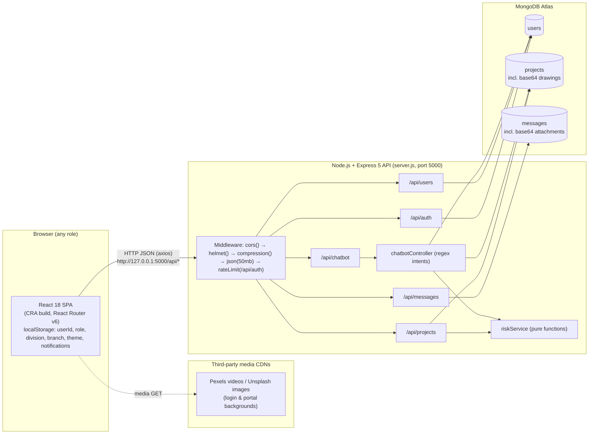
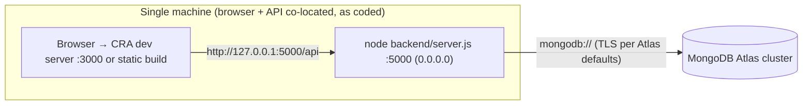

# 05 — System Architecture

## 5.1 Architectural Style (Verified)

| Aspect | Implemented style |
|---|---|
| Overall | **Three-tier client–server web application**: a React SPA (presentation) talks to an Express REST API (application), which talks to MongoDB (data). It follows the "MERN" stack pattern |
| Frontend | Single-Page Application. Client-side routing (React Router v6). Routes are lazily loaded. Each role has a **fat page component** that holds its own state, data fetching and business-flow logic |
| Backend | Monolithic Express application in **Router → Controller → Model** layers. One **Service** layer exists for risk scoring. Some routers hold their logic inline (`userRoutes.js`, `messageRoutes.js`, the `assign` handler in `projectRoutes.js`) |
| Data | Document-oriented (MongoDB through Mongoose). A job's entire workflow state is **denormalised into one `Project` document** |
| Communication | Synchronous HTTP/JSON REST through axios. Near-real-time behaviour comes from **client polling** (setInterval 4–8 s). There are no WebSockets or server push |
| State/session | **Stateless server with no session at all.** Identity lives only in the browser's `localStorage` |
| Workflow engine | None. Workflow transitions are **driven by the client**: the UI sends the target state fields through the generic `PUT /api/projects/update/:jobNo` |

Layers that **do not exist** (do not describe them in the report): API gateway, microservices, message queue, cache layer (Redis), file/object storage service, authentication server, WebSocket server, CI/CD pipeline, containerisation.

## 5.2 High-Level Architecture



## 5.3 Frontend Architecture

```
index.js
 └─ App.js  <BrowserRouter><Suspense fallback=<Spinner/>><Routes>
      ├─ "/"                      RedirectIfAuthenticated → Portal + Footer
      ├─ "/division/login"        RedirectIfAuthenticated → DivisionLogin
      ├─ "/headoffice/login"      RedirectIfAuthenticated → HeadOfficeLogin
      ├─ "/admin|engineer|user/login" (legacy) → per-role Login pages (use api.js)
      └─ 15 protected routes      ProtectedRoute(allowedRoles, requiredBranch) → lazy(Dashboard)
              each Dashboard = one component containing:
                • useState for every tab/form/list (no global store, no Redux/Context)
                • fetchData()/fetchUsers()/fetchUserProfile() via axios
                • setInterval polling (unread messages, job refresh)
                • handler functions → axios PUT/PATCH/POST/DELETE → refetch
                • tab-switched JSX sections, Recharts charts, jsPDF export
                • shared components: DivisionChat, JobTrackingTimeline, ToastStack,
                  NotificationCenter, RiskIntelligencePanel, ImageCropModal
```

- **State management:** local component state only (`useState`/`useRef`/`useMemo`). `localStorage` is the cross-page store (session identity, theme, accent colour, notifications, "seen" sets). `sessionStorage` holds minor UI state. Unused `AuthContext`/`ThemeContext` files exist but are not wired into the app.
- **API layer:** none in practice. Components call `axios` directly with absolute URLs. `api/api.js` is used only by the three legacy login pages.
- **Styling:** about 10,300 lines of hand-written CSS spread across per-dashboard files plus `premium-system.css` (theme tokens, dark mode). Tailwind is used mainly on the portal and login pages.

## 5.4 Backend Architecture

```
server.js
 ├─ middleware (global): cors, helmet, compression, json/urlencoded (50 MB)
 ├─ middleware (scoped): express-rate-limit on /api/auth
 ├─ connectDB() ─ config/db.js (mongoose.connect)
 ├─ /api/auth     → routes/authRoutes.js      → controllers/authController.js     → models/User
 ├─ /api/projects → routes/projectRoutes.js   → controllers/projectController.js  → models/Project
 │                                            → controllers/riskController.js     → services/riskService.js → config/riskConfig.js
 │                                            → (inline) PATCH /assign/:jobNo     → models/Project
 ├─ /api/users    → routes/userRoutes.js (inline handlers)                        → models/User
 ├─ /api/chatbot  → routes/chatbotRoutes.js   → controllers/chatbotController.js  → models/Project, models/User, riskController
 ├─ /api/messages → routes/messageRoutes.js (inline handlers, aggregation)        → models/Message
 └─ global error handler (500 JSON)
```

Defined but **not mounted**: `middleware/authMiddleware.js` (`preventCache`).

## 5.5 Database Architecture (summary — see 06)

Three collections. References are ObjectId `ref`s that the application resolves with `populate` (only `Message.replyTo`). Most cross-entity links are **denormalised strings**: `Project.division`, `Project.assignee` (a name), `Project.assignedDesignEngineerName`, and `statusHistory.by`. There are no transactions and no cascading deletes.

## 5.6 Authentication Flow (summary — see 10)

1. The login form sends `POST /api/auth/login {employeeId, password}`.
2. The server compares the bcrypt hash and returns the profile JSON. **No token or cookie is issued.**
3. The client checks the role against the gateway's allowed list and writes `userId`, `role`, `division`/`branch` and so on to `localStorage`.
4. On each protected route mount, `ProtectedRoute` re-reads `GET /api/users/:userId` and compares the role and branch.
5. Later API calls carry **no credentials**. Identity-dependent calls pass the user's ID in the URL or body.

## 5.7 Data Flow Between Components

| Flow | Path |
|---|---|
| Read (list) | Dashboard `fetchData()` → `GET /api/projects/division/:div` or `/all` → `Project.find().select('-drawingFileUrl').sort().lean()` → JSON array → `setState` → render/filter/charts |
| Workflow write | Button handler → `PUT /api/projects/update/:jobNo {fields…, historyEvent, historyActor}` → `findOneAndUpdate({$set, $push})` → JSON → handler refetches |
| File upload | `<input type=file>` → `FileReader.readAsDataURL` → base64 string in JSON body → stored in `Project.drawingFileUrl` / `Message.attachment.fileData` / `User.profilePic` |
| File download | `GET /api/projects/job/:jobNo` → `drawingFileUrl` → `<a href=dataURL download>` or a new window |
| Near-real-time | `setInterval` polling: unread counts (4 s Admin/Engineer/DA/chat, 6 s User), Admin job refresh (8 s), chat history (4 s) |
| Derived analytics | Risk: server-side pure functions. Charts and stat cards: client-side aggregation of fetched arrays |

## 5.8 Third-Party Integrations

| Integration | Type | Evidence |
|---|---|---|
| MongoDB Atlas | Managed DB (connection string) | `.env` host domain |
| Pexels / Unsplash | Static media hot-linked from the CDN | `Portal.jsx`, login pages |
| Footer links (WhatsApp, Instagram, Facebook) | Plain hyperlinks (placeholder phone number) | `Footer.jsx` |
| AI/LLM APIs | **None.** The chatbot is rule-based | `chatbotController.js` |
| E-mail/SMS | **None** | — |

## 5.9 File Storage Architecture

There is no file system or object storage. All binary content is encoded as **base64 data URLs and embedded in MongoDB documents**:

| Content | Field | Limit enforced |
|---|---|---|
| Structural drawing | `Project.drawingFileUrl` (String) | Only the 50 MB request body limit; no type check (the user download assumes `.pdf`) |
| Chat attachment | `Message.attachment.{fileName,fileType,fileData}` | 5 MB (client) / 7 MiB base64 length (server) |
| Profile photo | `User.profilePic` (String) | `image/*` check on the client only |

Implications: each MongoDB document is capped at 16 MB (BSON limit), and base64 inflates data by about 33 %. List endpoints therefore exclude `drawingFileUrl`.

## 5.10 Error Handling Architecture

- **Backend:** every handler wraps its logic in `try/catch` and returns `4xx/5xx` JSON. Shapes are inconsistent across modules: `{error}`, `{message, error}`, or symbolic codes such as `USER_NOT_FOUND`. A global Express error handler returns `500 {error: err.message}`. Raw error messages are sent to clients (information exposure).
- **Frontend:** `try/catch` around axios. Feedback uses toasts (`addToast`), `alert()`, or inline messages. `ProtectedRoute` separates "denied" from "unreachable". There is no React error boundary.

## 5.11 Deployment Architecture

Production hosting is **not evidenced in the repository** (see `11_Deployment_and_Hosting.md`). The only architecture the code supports is:



→ **REQUIRES TEAM CONFIRMATION**: the actual production frontend host, backend host and domain, and how the hard-coded `127.0.0.1` URLs were handled in the deployed build.
