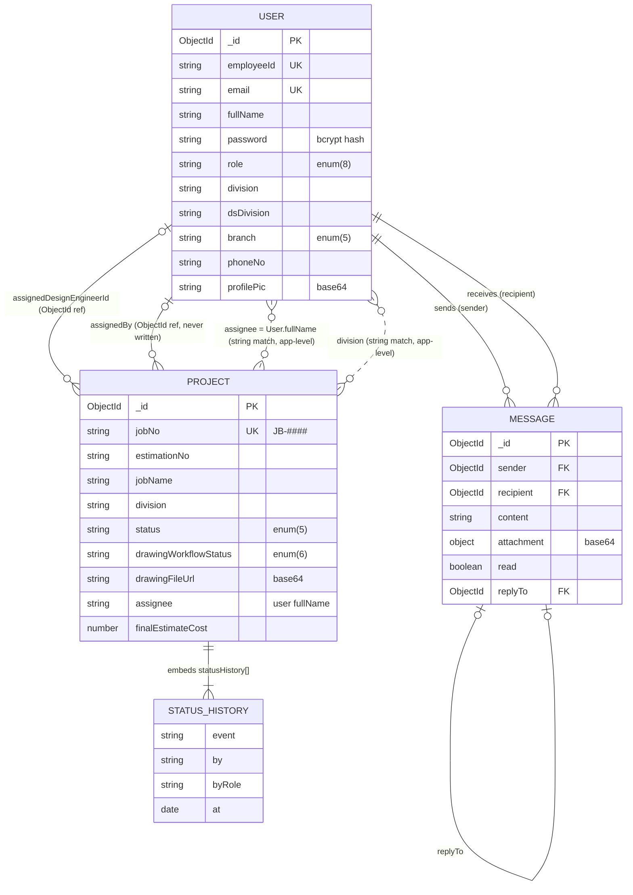
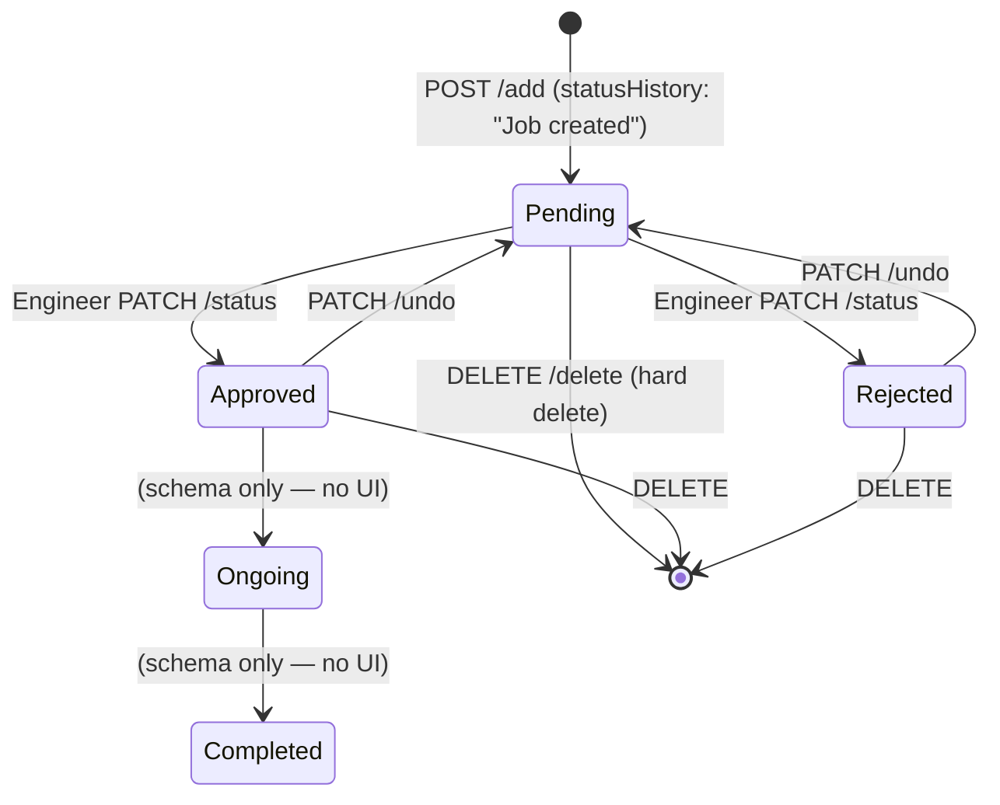

# 06 — Database Design and Data Management

## 6.1 Technology and Configuration

| Item | Value | Evidence |
|---|---|---|
| DBMS | MongoDB (document store) | `mongoose` dependency |
| Hosting | MongoDB Atlas (`mongodb.net` host in the untracked `.env`) | `.env` (host domain only) |
| ODM | Mongoose 9.9.1 | `backend/node_modules/mongoose` |
| Connection | `mongoose.connect(process.env.MONGODB_URI)` with default options; logs the host; `process.exit(1)` on failure | `backend/config/db.js:4-18` |
| CLI fallback URI | local `mongodb://127.0.0.1:27017/civilManagement` | `seedDefaultUsers.js:33`, `resetPassword.js:18` |
| Collections | `users`, `projects`, `messages` (Mongoose pluralisation of the model names) | `models/*.js` |
| Schema strictness | Mongoose default `strict: true`: fields not in the schema are **silently dropped** on save or update | Mongoose default (Verified behaviour) |
| Migrations | None. Legacy jobs get an Estimation No. lazily on their next update (`projectController.js:212-222`) | — |

## 6.2 Entity Overview

Dashed lines are **logical relationships that only exist through string equality in application code**. MongoDB does **not** enforce any of these relationships: there are no foreign-key constraints, cascades or referential checks.

## 6.3 Data Dictionary

### 6.3.1 `User` (collection `users`) — `backend/models/User.js`

| Field | Data Type | Description | Required | Constraints | Relationships |
|---|---|---|---|---|---|
| `_id` | ObjectId | Primary identifier | auto | — | Referenced by `Message.sender/recipient`, `Project.assignedDesignEngineerId`, `Project.assignedBy` |
| `fullName` | String | Display name | Yes | `trim` | **Matched by value** in `Project.assignee` and `assignedDesignEngineerName` |
| `employeeId` | String | Login username (e.g. engineer IDs of the form `en
1`) | Yes | **unique**, `trim` | — |
| `email` | String | E-mail | Yes | **unique**, `lowercase` | — |
| `password` | String | bcrypt hash (salt rounds 12) | Yes | Hashed in the `pre('save')` hook when modified | Excluded from API reads with `.select('-password')` |
| `role` | String | Role code | Yes | enum: `admin, engineer, division_assistant, user, clerk, headoffice_admin, branch_engineer, branch_director`; default `engineer` | — |
| `division` | String | Field division | Conditional: required unless role ∈ {admin, headoffice_admin, branch_engineer, branch_director} | **Indexed** `{division:1}`; pre-save: ≤ 1 `engineer` per division | Logical join to `Project.division` |
| `dsDivision` | String | Divisional Secretariat area | No | default `''` | — |
| `branch` | String | Head Office branch | Conditional: required if role ∈ {branch_engineer, branch_director} | enum: `design, branch-a, branch-b, branch-c, branch-d`; pre-save: ≤ 1 `branch_director` per branch | — |
| `phoneNo` | String | Phone | No | default `''` (UI restricts input to 10 digits) | — |
| `profilePic` | String | Profile photo as a base64 data URL | No | default `''` | — |
| `createdAt` / `updatedAt` | Date | Mongoose timestamps | auto | — | — |

**Fields written by code but absent from the schema, and therefore silently discarded:** `isVerified`, `lastLogin` (`authController.js:99-113`, `seedDefaultUsers.js:74`), and `attributes`, `recoveryQuestion`, `recoveryAnswer` (`authController.js:44-52`).

**Methods/hooks:** `pre('save')` (uniqueness rules plus hashing), `comparePassword(candidate)` (`User.js:36-71`).

### 6.3.2 `Project` / "Job" (collection `projects`) — `backend/models/Project.js`

| Field | Data Type | Description | Required | Constraints / Default | Relationships |
|---|---|---|---|---|---|
| `_id` | ObjectId | Internal ID | auto | — | — |
| `jobNo` | String | Business key `JB-1000…9999` | Yes | **unique**, indexed | Used in every URL (`/:jobNo`) |
| `estimationNo` | String | `YY-DIVCODE-DEPTCODE-N/R-SERIAL` | No | indexed; default `''` | — |
| `jobName` | String | Job title or activity | Yes | — | — |
| `division` | String | Owning division | Yes | Part of compound index | Logical → `User.division` |
| `ministry` | String | Requesting ministry | Yes | — | — |
| `department` | String | Requesting department | Yes | — | — |
| `institute` | String | Beneficiary institute | No | — | — |
| `work` | String | Work type | No | enum `N` (New), `R` (Repair); default `N` | — |
| `allocation` | String | Budget allocation (numeric text) | Yes | Stored as **String** and parsed with `parseFloat` | — |
| `dateReq` | Date | Request date | Yes | — | — |
| `ref` | String | Request-letter reference | Yes | — | — |
| `assignee` | String | Assigned field officer | No | default `''` | **Holds the User's `fullName`**, not an ID |
| `submitDate` | Date | Record date | No | default `Date.now` | Shown as "deadline" in the User UI |
| `status` | String | Job approval status | No | enum `Pending, Approved, Rejected, Ongoing, Completed`; default `Pending` | `Ongoing`/`Completed` are never set by the UI |
| `deptIdNo` | String | Department ID number | No | default `''` | — |
| `source` | String | Funding/request source | No | default `''` (UI options: PSDG, Recurrent, GEMP, Clean SL, National School, DDP, IDPPM, Other) | — |
| `dsDivision` | String | DS division | No | default `''` | Peer group for the risk allocation factor |
| `remark` | String | Free text | No | default `''` | — |
| `fieldVisitedDate` | Date | Site visit date | No | — | — |
| `fieldEstimateAmount` | Number | Initial field estimate | No | — (read by Design Engineer analytics; **no writer found**) | — |
| `drawingNeeded` | Boolean | Drawing needed? | No | default `null` (= undecided) | — |
| `estimateSubmitted` / `estimateSubmittedAt` | Boolean / Date | Drawing request raised | No | default `false` | — |
| `drawingReceived` / `drawingReceivedAt` | Boolean / Date | Drawing delivered to the User | No | default `false` | — |
| `drawingFileUrl` | String | Drawing as a base64 data URL | No | default `''`; **excluded from list queries** | — |
| `finalEstimateCost` | Number | Final estimate | No | — | — |
| `finalEstimateDate` | Date | "Alignment" date of the final estimate | No | — | — |
| `finalEstimateSubmittedAt` | Date | Submission timestamp | No | — | — |
| `drawingWorkflowStatus` | String | Drawing pipeline state | No | enum `NotRequested, PendingDA, PendingDirectorAssignment, PendingEngineerDesign, PendingDirectorDesign, Completed`; default `NotRequested` | — |
| `drawingRequestedAt`, `daDrawingForwardedAt`, `drawingAttachedAt`, `directorApprovedAt` | Date | Pipeline timestamps | No | — | — |
| `drawingDaStatus` | String | DA decision on the drawing request | No | enum `Pending, Approved, Rejected`; default `Pending` | — |
| `drawingDaReviewedAt` / `drawingDaNote` | Date / String | DA review metadata | No | note default `''` | — |
| `assignedDesignEngineerId` | ObjectId | Design engineer | No | `ref: 'User'`, default `null` | → `User._id` (never populated) |
| `assignedDesignEngineerName` | String | Denormalised name | No | default `''` | — |
| `assignedDesignEngineerAt` | Date | Assignment time | No | — | — |
| `daReviewStatus` | String | DA review of the final estimate | No | enum `Pending, Approved, Rejected`; default `Pending` | — |
| `daReviewedAt` / `daReviewNote` / `daReviewedBy` | Date / String / String | DA review metadata (`daReviewedBy` = DA name) | No | defaults `''` | — |
| `engineerReviewStatus` | String | Engineer review of the final estimate | No | enum `Pending, Approved, Rejected`; default `Pending` | — |
| `engineerReviewedAt` / `engineerReviewNote` | Date / String | Engineer review metadata | No | — | — |
| `assignedBy` | ObjectId | (Intended) assigner | No | `ref: 'User'` | **Never written** |
| `statusHistory[]` | Array<Subdoc> | Audit trail | No | each `{event (req), by, byRole, at (default now)}` | `by` = actor name (client-supplied) |
| `createdAt` / `updatedAt` | Date | Timestamps | auto | Indexes `{division:1, createdAt:-1}`, `{createdAt:-1}` | `updatedAt` is used by the risk staleness factor |

### 6.3.3 `Message` (collection `messages`) — `backend/models/Message.js`

| Field | Data Type | Description | Required | Constraints | Relationships |
|---|---|---|---|---|---|
| `_id` | ObjectId | ID | auto | — | — |
| `sender` | ObjectId | Author | Yes | `ref: 'User'` | → `User._id` |
| `recipient` | ObjectId | Addressee | Yes | `ref: 'User'` | → `User._id` |
| `content` | String | Text | No | `trim`, default `''` | — |
| `attachment` | Object `{fileName, fileType, fileData}` | Attached file (base64) | No | default `undefined`; server rejects `fileData` longer than 7 MiB | — |
| `read` | Boolean | Read flag | No | default `false` | — |
| `replyTo` | ObjectId | Quoted message | No | `ref: 'Message'`, default `null` | → `Message._id` (**populated**) |
| `createdAt` / `updatedAt` | Date | Timestamps | auto | — | — |

Indexes: `{recipient:1, read:1}` (unread aggregation) and `{sender:1, recipient:1, createdAt:1}` (conversation history).

## 6.4 Identifiers and Business Keys

| Key | Generation | Evidence | Caveat |
|---|---|---|---|
| `jobNo` | `JB-` + random integer 1000–9999. Re-generated if `findOne` finds a collision | `projectController.js:4-9` | Only 9,000 values are possible. Check-then-insert is not atomic; the unique index is the final guard |
| `estimationNo` | `YY-DIVCODE-DEPTCODE-WORK-SERIAL`, e.g. `26-ANU E-610-N-01` | `projectController.js:66-86` | SERIAL = `countDocuments(same division, department, work, year)+1`. This is not atomic and has no unique index, so concurrent inserts or deletions can produce duplicates |
| Division codes | Anuradhapura-East→`ANU E`, Anuradhapura-West→`ANU W`, Medawachchiya→`MED`, Mihinthale→`MIH`, Kekirawa→`KEK`, Thambuttegama→`THA`, Polonnaruwa→`POL`, Hingurakgoda→`HIN` | `projectController.js:54-63` | Unknown division names fall back to the raw name |
| Department codes | 21 department→3-digit codes; ministry fallback codes (610/620/640/660); otherwise `000` | `projectController.js:15-52` | "Ministry of Health" and "Ministry of Local Government" have no ministry fallback code |

## 6.5 Data Lifecycle of a Job Document

The drawing and estimate sub-states are shown in `09_Complete_System_Workflows.md`.

## 6.6 File Metadata Storage

- Drawings: only the data URL is stored. The MIME type is embedded in the URL prefix. There is no file name, size or uploader field; the uploader is inferred from `assignedDesignEngineerName` and `statusHistory`.
- Chat attachments: `fileName`, `fileType`, `fileData`.
- Profile photos: data URL in `profilePic`. A copy is also cached in the browser's `localStorage`.

## 6.7 Deletion Behaviour and Referential Integrity

| Operation | Behaviour | Consequence |
|---|---|---|
| `DELETE /api/projects/delete/:jobNo` | Hard delete (`findOneAndDelete`) | No soft-delete or archive. History is lost. The Estimation No. serial count drops, so a later job may reuse a serial |
| `DELETE /api/users/:id` | Hard delete (`findByIdAndDelete`) | Messages to and from the user remain with dangling ObjectIds. Projects keep the user's name in `assignee`. `assignedDesignEngineerId` dangles. If an engineer is deleted, the division has no engineer until a new one is seeded |
| `DELETE /api/messages/:id` | Hard delete if `?userId` = sender | Replies that reference it are populated as `null` |
| Rename user (`PATCH /:id/profile`) | `fullName` changes | **Assigned jobs disappear from the User dashboard**, which matches on `assignee === fullName` |

There are no transactions or multi-document atomic operations. Each workflow step is a single-document `findOneAndUpdate`, which MongoDB applies atomically for that document.

## 6.8 Important Database Operations

| Operation | Query | Location |
|---|---|---|
| Division job list | `Project.find({division}).select('-drawingFileUrl').sort({createdAt:-1}).lean()` | `projectController.js:135` |
| Global job list | `Project.find().select('-drawingFileUrl').sort({createdAt:-1}).lean()` | `projectController.js:123` |
| Workflow update | `Project.findOneAndUpdate({jobNo}, {$set: updates, $push: {statusHistory}}, {new:true})` | `projectController.js:224-236` |
| Estimation serial | `Project.countDocuments({division, department, work, dateReq:{$gte, $lt}})` | `projectController.js:77-82` |
| Unread counts | `Message.aggregate([$match {recipient, read:false}, $group {_id:"$sender", count}])` | `messageRoutes.js:70-73` |
| Conversation previews | `aggregate($match $or, $sort, $addFields partner, $group $first)` | `messageRoutes.js:91-108` |
| Mark read | `Message.updateMany({sender, recipient, read:false}, {$set:{read:true}})` | `messageRoutes.js:150-153` |
| Division users | `User.find({division: {$regex: ^div$ (case-insensitive)}, role: {$ne:'admin'}}).select('-password')` | `userRoutes.js:120-123` |
| Risk peers | `Project.find({dsDivision}).select('allocation dsDivision').lean()` | `riskController.js:14-16` |

## 6.9 Data Consistency Considerations

1. `findOneAndUpdate` and `findByIdAndUpdate` are called **without `runValidators: true`**, so enum and required checks are **not** enforced on updates. Invalid workflow states can be written.
2. The generic `PUT /update/:jobNo` applies **any body field** with `$set`. Mongoose strict mode removes unknown paths, but every known field can be overwritten, including `jobNo` and `statusHistory`.
3. Users are matched to their jobs by name and division by string. Case or spelling differences break the link. Example: the seed script uses "Thambuththegama" and "Higurakgoda", while the job form and code tables use "Thambuttegama" and "Hingurakgoda". → **REQUIRES TEAM CONFIRMATION**: which spellings exist in production data.
4. Monetary values are mixed: `allocation` is a String, while `finalEstimateCost` and `fieldEstimateAmount` are Numbers.

## 6.10 Database Security Mechanisms (implemented)

- Password hashes only; `-password` projection on every user read endpoint.
- The connection string is kept in `.env`, which is git-ignored.
- `escapeRegex` utility exists but is **not applied**. Unescaped user input is placed in `RegExp` in `userRoutes.js:121` and `chatbotController.js:423`.
- No field-level encryption and no DB-level role separation is evidenced in the repository. Atlas network-access and user settings are **REQUIRES TEAM CONFIRMATION**.

## 6.11 Backup and Recovery Evidence

None in the repository: no dump scripts, scheduled jobs or documentation. Atlas cluster tiers may provide snapshots. → **REQUIRES TEAM CONFIRMATION** (cluster tier, backup policy, restore test).
