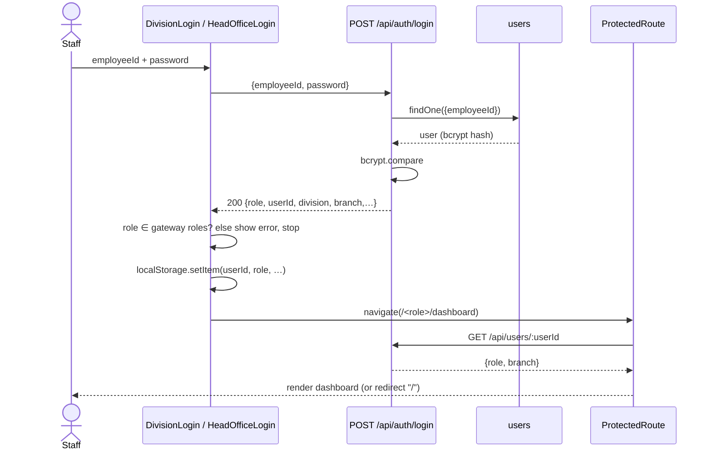
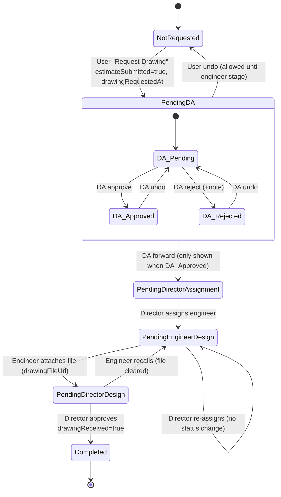
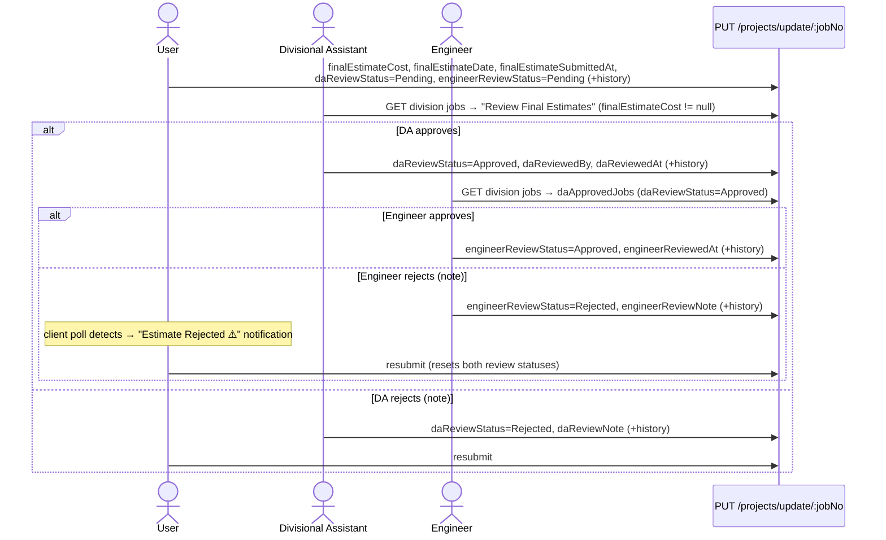

# 09 — Complete System Workflows

All workflows below were reconstructed from handler code. In every workflow the **client decides the next state** and writes it through the generic update endpoint. The server does not check whether a transition is valid (see §9.12).

## 9.0 End-to-End Job Lifecycle (overview)

```mermaid
flowchart TD
  A[Clerk/Admin registers job<br/>status=Pending, history 'Job created'] --> B{Engineer decision}
  B -- Reject --> BR[status=Rejected<br/>clerk notified (client poll)]
  BR -. undo .-> B
  B -- Approve --> C[status=Approved]
  C --> D[Engineer assigns field officer<br/>assignee = user fullName]
  D --> E[User: confirm field-visit date<br/>declare drawingNeeded]
  E -- drawing NOT needed --> J
  E -- drawing needed --> F[User requests drawing<br/>drawingWorkflowStatus=PendingDA]
  F --> G{DA review}
  G -- Reject --> GR[drawingDaStatus=Rejected + note<br/>(stays PendingDA)]
  G -- Approve --> G2[DA forwards<br/>→ PendingDirectorAssignment]
  G2 --> H[Design Director assigns Design Engineer<br/>→ PendingEngineerDesign]
  H --> I[Design Engineer attaches drawing<br/>→ PendingDirectorDesign]
  I -. recall .-> H
  I --> I2[Design Director approves<br/>→ Completed, drawingReceived=true]
  I2 --> J[User submits final estimate<br/>daReviewStatus=Pending, engineerReviewStatus=Pending]
  J --> K{DA review of estimate}
  K -- Reject --> KR[daReviewStatus=Rejected<br/>User may resubmit]
  KR -.-> J
  K -- Approve --> L{Engineer review}
  L -- Reject --> LR[engineerReviewStatus=Rejected<br/>User notified (client poll)]
  LR -.-> J
  L -- Approve --> M[engineerReviewStatus=Approved<br/>END of implemented pipeline]
```

**Important:** the pipeline ends at the Engineer approving the final estimate. Nothing in the UI moves `status` to `Ongoing` or `Completed`, records construction progress, or closes the job.

---

## WF-1 Login and Role Routing

| # | Item | Detail |
|---|---|---|
| 1 | Objective | Authenticate staff and route them to the correct portal |
| 2 | Initiator | Any staff member |
| 3 | Preconditions | An account exists (seeded, or created by an Engineer or the Head Office) |
| 4 | Steps | (1) Portal → choose Division or Head Office. (2) Enter Employee ID and password. (3) `POST /api/auth/login`. (4) The client checks the role against the gateway's allowed list. (5) Write the session keys to localStorage. (6) `navigate()` to the role dashboard. (7) `ProtectedRoute` re-verifies through `GET /api/users/:id` |
| 7 | Frontend | `DivisionLogin.js:50-111`, `HeadOffice/Login.jsx:54-110`, `ProtectedRoute.js:17-60` |
| 8 | Backend | `authController.login` |
| 9 | DB | `users.findOne({employeeId})`, `save` |
| 14 | Result | Dashboard rendered |
| 15 | Failure paths | Unknown ID (404), wrong password (401), missing fields (400), rate limit (429), wrong gateway for the role ("This portal is not … available"), backend unreachable ("Couldn't reach the server") |



---

## WF-2 Job Registration

| Item | Detail |
|---|---|
| Objective | Record an incoming ministry or department works request |
| Initiator | `clerk` (own division) or `admin` (any division) |
| Preconditions | Logged in on `/admin/dashboard` |
| Steps | (1) New Job tab. (2) Select ministry → department list filters. (3) Select division (locked for a clerk) → DS-division list filters. (4) Enter job name, allocation, request date, reference, institute, department ID no., source, work type N/R, remark. (5) Save |
| Frontend | `admin/Dashboard.jsx:695-719` (`handleAddJob`); `historyActor` from `getHistoryActor()` |
| Backend | `POST /api/projects/add` → `generateJobNo`, `generateEstimationNo`, save |
| DB ops | `findOne({jobNo})` (collision check), `countDocuments` (serial), `insert` |
| Status change | (new) → `status=Pending`, `drawingWorkflowStatus=NotRequested`, all review statuses `Pending` |
| History | "Job created" by the clerk or admin |
| Result | Job appears in the Engineer's My Jobs, the DA's View Jobs and the Head Office/Branch records |
| Alternatives | Edit (`PUT /update/:jobNo`, no history entry), Delete (`DELETE`, confirm dialog) |
| Failures | Missing required field → `500 Error creating job` shown as a toast |

---

## WF-3 Engineer Approval and Field-Officer Assignment

| Item | Detail |
|---|---|
| Objective | Technically approve the request and allocate a field officer |
| Initiator | `engineer` |
| Preconditions | The job is in the Engineer's division |
| Steps | (1) My Jobs → Approve or Reject (`PATCH /status`, history "Approved/Rejected by Engineer"). (2) Optional Undo → `PATCH /undo` (status Pending, **no history**). (3) Choose an assignee from the division users with role `user` → `PATCH /assign` |
| Frontend | `engineer/Dashboard.jsx:580-641, 1395-1400` |
| DB | `findOneAndUpdate` on `status` / `statusHistory` / `assignee` |
| Cross-portal effect | The clerk's dashboard polls every 8 s and raises "rejected" notifications. The User sees the job under My Jobs when `assignee === fullName` |
| Business rule | The assignee dropdown is rendered only for jobs with `status === 'Approved'` (`trackedJobs`, `engineer/Dashboard.jsx:788, 1387-1400`), and the dropdown lists only `role==='user'` staff of the same division. **The API does not enforce this**: `PATCH /assign` accepts any job and any string |

---

## WF-4 Structural Drawing Request Pipeline (cross-portal)

| Item | Detail |
|---|---|
| Objective | Obtain a structural drawing from the Head Office Design branch for a field job |
| Initiator | `user` (field officer) |
| Preconditions | The job is assigned to the user; the field-visit date is confirmed; `drawingNeeded=true` |
| Roles involved | User → Divisional Assistant → Design Director → Design Engineer → Design Director → User |

**State machine (`drawingWorkflowStatus` + `drawingDaStatus`):**



**Step-by-step:**

| Step | Actor & UI | Request (PUT `/api/projects/update/:jobNo`) | History event | Evidence |
|---|---|---|---|---|
| 1 | User → Update Progress → confirm date, "Drawing needed: Yes" | `{drawingNeeded:true}` | — | `user/Dashboard.jsx:707-722` |
| 2 | User → "Request Drawing" | `{fieldVisitedDate, estimateSubmitted:true, estimateSubmittedAt, drawingWorkflowStatus:'PendingDA', drawingRequestedAt}` | Drawing requested by User | `user/Dashboard.jsx:651-688` |
| 3a | DA → Drawing Requests → Approve | `{drawingDaStatus:'Approved', drawingDaReviewedAt, drawingDaNote:''}` | Drawing request approved by DA | `DivisionalAssistant/Dashboard.jsx:386-401` |
| 3b | DA → Reject (prompt note) | `{drawingDaStatus:'Rejected', …, drawingDaNote}` | Drawing request rejected by DA | `:403-420` |
| 3c | DA → Undo | `{drawingDaStatus:'Pending', …}` | — | `:422-435` |
| 4 | DA → Forward (button only when Approved, `:1264-1265`) | `{drawingWorkflowStatus:'PendingDirectorAssignment', daDrawingForwardedAt}` | Drawing forwarded to Design Director | `:437-452` |
| 5 | Design Director → Assign tab → choose engineer → Assign | `{drawingWorkflowStatus:'PendingEngineerDesign', assignedDesignEngineerId, assignedDesignEngineerName, assignedDesignEngineerAt}` | Assigned to Design Engineer | `Design/Director/Dashboard.jsx:323-350` |
| 5b | Director → Re-assign | `{assignedDesignEngineerId, …Name, …At}` | — | `:352-378` |
| 6 | Design Engineer → Pending → choose file → Attach | `{drawingFileUrl:<dataURL>, drawingWorkflowStatus:'PendingDirectorDesign', drawingAttachedAt}` | Drawing attached by Design Engineer | `Design/Engineer/Dashboard.jsx:411-438` |
| 6b | Design Engineer → Completed → Recall (before approval) | `{drawingWorkflowStatus:'PendingEngineerDesign', drawingFileUrl:'', drawingAttachedAt:null}` | — | `:440-455` |
| 7 | Design Director → Pending → View attachment (`GET /job/:jobNo`) → Approve | `{drawingWorkflowStatus:'Completed', directorApprovedAt, drawingReceived:true, drawingReceivedAt}` | Drawing approved by Design Director | `Design/Director/Dashboard.jsx:505-540` |
| 8 | User → notification "drawing received" (client diff on `drawingReceived`) → Download | `GET /api/projects/job/:jobNo` → `<a download="Drawing_<jobNo>.pdf">` | — | `user/Dashboard.jsx:377, 628-644` |

**Notifications (client-side only):** the Design Director is notified when a job newly enters `PendingDirectorAssignment` or `PendingDirectorDesign` (`Design/Director/Dashboard.jsx:142-178`). The Design Engineer is notified when newly assigned (`Design/Engineer/Dashboard.jsx:232-255`). The User is notified when the drawing is received. These notifications are generated only while the recipient's dashboard is open and polling, or on their next load. They are not delivered while the recipient is offline (the first load sets a baseline).

**Tracking views:** DA "Drawing Tracking" (stage labels such as "With Design Director", "Assigned to <name>", "Awaiting Director Approval", "Drawing Sent to User", `DivisionalAssistant/Dashboard.jsx:370-383`). Engineer "Drawing Tracking" tab.

**Failure and alternative paths:** the DA rejects (the job stays in `PendingDA` with Rejected; the user sees the note; no re-request path other than the DA's undo). The User undoes before the engineer stage. The engineer recalls. The Director re-assigns. **There is no Director "reject drawing" action.** A network error shows a toast or alert and leaves the state unchanged.

---

## WF-5 Final Estimate Submission and Two-Stage Review

| Item | Detail |
|---|---|
| Objective | Get the field officer's final cost estimate validated by the DA and then the Engineer |
| Initiator | `user` |
| Preconditions | Job assigned. **Drawing-needed path:** the "Final Estimate Cost & Drawing Alignment" section stays locked until `drawingReceived` is true, i.e. after the Design Director approves (`user/Dashboard.jsx:1473-1475`, submit button at `:1554`). **No-drawing path:** a separate submit form is available directly (`:1639`). As elsewhere, the gate exists only in the UI |



| Step | Actor | Fields | History | Evidence |
|---|---|---|---|---|
| Submit | User | `fieldVisitedDate, finalEstimateCost, finalEstimateDate, finalEstimateSubmittedAt`, reset the DA and Engineer review fields | Final estimate submitted by User | `user/Dashboard.jsx:724-753` |
| DA approve / reject / undo | DA | `daReviewStatus, daReviewedAt, daReviewNote, daReviewedBy` | approved/rejected by DA (none on undo) | `DivisionalAssistant/Dashboard.jsx:455-509` |
| Engineer approve / reject | Engineer | `engineerReviewStatus, engineerReviewedAt, engineerReviewNote` | approved/rejected by Engineer | `engineer/Dashboard.jsx:602-622` |
| Engineer undo | Engineer | `PATCH /undo-engineer-review` | — | `projectController.js:245-262` |

Gating: the Engineer's review list is `finalEstimateCost != null && daReviewStatus === 'Approved'` (`engineer/Dashboard.jsx:792`). This gate exists in the UI only.

---

## WF-6 Division Staff Onboarding

Engineer → Add User tab → fill in employee ID, first and second name, e-mail, phone, password, division (defaults to own), DS division, role (DA / User / Clerk) → `POST /api/users/add`. The server checks the role whitelist, duplicate ID and duplicate e-mail, then saves (bcrypt hook). The new user can log in immediately through the Division gateway. Editing (`PUT /users/:id`) and deletion (`DELETE /users/:id`) happen from the same tab (`engineer/Dashboard.jsx:550-578, 709-740`).

## WF-7 Head Office Branch Staff Onboarding

Head Office admin → Assign Staff → employee ID, name, e-mail, phone, password, branch (5), role (branch engineer or director) → `POST /api/users/branch-add` → the pre-save hook rejects a second director for the same branch. Branches tab: filter, edit (name, e-mail, phone) and delete (`HeadOffice/Dashboard.jsx:125-209`). The new user logs in through the Head Office gateway and is routed to `/<branch>/<engineer|director>/dashboard`.

## WF-8 In-Division Messaging

(1) Open Messages → `GET /users/division/:div` (excluding self). (2) Every 4 s: `GET /messages/unread/:me`, `GET /messages/conversations/:me`. While a chat is open, also `GET /messages/:me/:other` and `PUT /messages/read/:other/:me`. (3) Send → `POST /messages` (text, optional reply, optional attachment ≤ 5 MB). (4) Delete own → `DELETE /messages/:id?userId=me`. Dashboard sidebars show the total unread badge from separate polling. Messaging is limited to the same division; Head Office roles have no chat.

## WF-9 Risk Assessment and Chatbot Query

- **Risk panel:** Engineer Overview mounts `RiskIntelligencePanel` → `GET /api/projects/risk/summary?division=<div>` → the server scores every division job → the panel shows the distribution and the top at-risk jobs with evidence. A Refresh button recalculates.
- **Chatbot:** Engineer AI Assistant → `POST /api/chatbot/query {message, division}` → job lookup or intent → text report → rendered with simple bold and italic markdown (`engineer/Dashboard.jsx:263, 286-296`).

## WF-10 Job Tracking (audit view)

Any dashboard with a Job Tracking tab → choose a job in `JobTrackingTimeline` → the timeline of `statusHistory` entries (event, actor, role label, timestamp) is shown; the last entry is labelled "current location". The data comes from the dashboard's already-scoped job list (no extra API call).

## WF-11 Profile and Password Maintenance

Profile tab → edit name, e-mail and phone → `PATCH /users/:id/profile` (localStorage is updated too). Photo → (crop) → the same endpoint with `profilePic`. Settings → change password → `PATCH /users/:id/password` (current password required, ≥ 4 characters). The DA's flow fails (404, wrong path). The CLI `resetPassword.js` exists for administrators.

---

## 9.11 Information Flow Between Portals

| From → To | Carrier | Mechanism |
|---|---|---|
| Clerk → Engineer | New job document (division) | Engineer's next `GET /projects/division` |
| Engineer → Clerk | `status=Rejected` | Clerk polls every 8 s → client notification |
| Engineer → User | `assignee` = user's name | User's 6 s poll / reload |
| User → DA | `drawingWorkflowStatus=PendingDA`; `finalEstimateCost` set | DA's job fetch (on load / refresh) |
| DA → Design Director (Head Office) | `PendingDirectorAssignment` | Director's `GET /projects/all` + client notification |
| Design Director → Design Engineer | `assignedDesignEngineerId` | Engineer's fetch + notification |
| Design Engineer → Design Director | `PendingDirectorDesign` + `drawingFileUrl` | Director's fetch + notification |
| Design Director → User | `Completed`, `drawingReceived=true` | User's poll + notification |
| DA → Engineer | `daReviewStatus=Approved` | Engineer's "Review Final Estimates" |
| Engineer → User | `engineerReviewStatus=Rejected` | User's poll + notification |
| Any → Head Office / Branch A–D | All job fields | Read-only `GET /projects/all` |

There is no message broker. **The shared `Project` document is the integration point between portals.**

## 9.12 Workflow Integrity Observations

1. Transitions are not validated on the server. The generic update endpoint lets any client set any state, e.g. jump straight to `Completed`.
2. History events are optional and supplied by the client; undo, assign, re-assign and recall actions leave no audit entry.
3. Notifications are only computed in the client and are not persisted for offline users (beyond localStorage on the same browser).
4. The User's job list depends on an exact name match.
