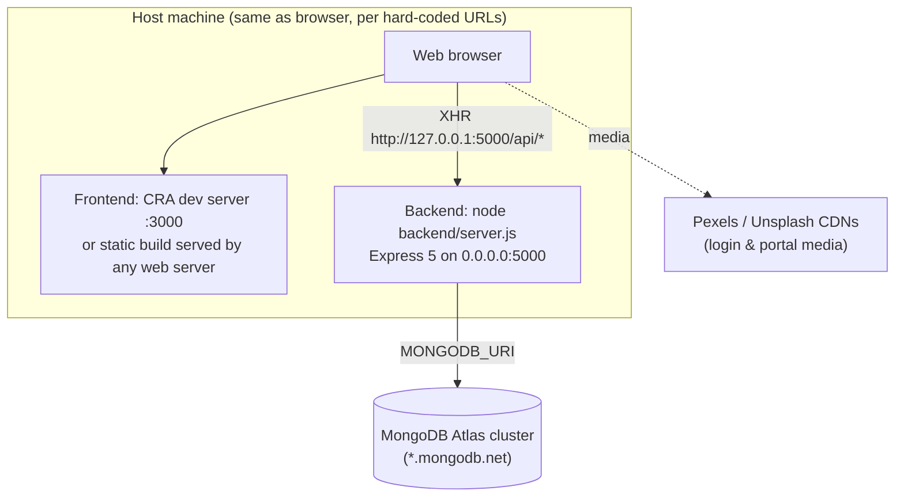

# 11 — Deployment and Production Environment

> **Key finding:** the team reports that the System is deployed. **The repository contains no deployment evidence.** Every branch was checked (`main`, `legacy-backup` and all `*_dev` branches) for Vercel, Netlify, Render, Railway, Heroku `Procfile`, Docker and GitHub Actions files, and none were found. Every frontend API call is also hard-coded to `http://127.0.0.1:5000` (109 occurrences on `main`). Most production facts below are therefore marked **REQUIRES TEAM CONFIRMATION**.

## 11.1 Evidence Matrix

| # | Topic | Repository evidence | Status |
|---|---|---|---|
| 1 | Hosting platforms | None | **REQUIRES TEAM CONFIRMATION** |
| 2 | Frontend hosting | CRA `npm run build` produces a static `build/` (git-ignored) | Platform: **REQUIRES TEAM CONFIRMATION** |
| 3 | Backend hosting | `node server.js` on `PORT` or 5000, binds to `0.0.0.0`; no `start` script | Platform: **REQUIRES TEAM CONFIRMATION** |
| 4 | Database hosting | MongoDB Atlas (`mongodb.net` host in the local `.env`) | **Verified** (domain only). Cluster tier and region: **REQUIRES TEAM CONFIRMATION** |
| 5 | Production build | `react-scripts build` (frontend); none needed for the backend | Verified |
| 6 | Deployment configuration | None | **Missing** |
| 7 | Environment variables | Backend: `MONGODB_URI`, `PORT`, (`JWT_SECRET` unused). Frontend: none | Verified |
| 8 | Frontend↔backend in production | Hard-coded `127.0.0.1:5000` only works when the API runs on the **same machine as the viewer's browser** | **Conflict with "deployed" claim → REQUIRES TEAM CONFIRMATION** |
| 9 | HTTPS / domain | Not configured in the application | **REQUIRES TEAM CONFIRMATION** |
| 10 | CORS | `cors()` allow-all, so any domain can call the API | Verified |
| 11 | Deployment scripts | Only `seedDefaultUsers.js` and `resetPassword.js` (DB utilities) | Verified |
| 12 | CI/CD | None (`.github/workflows` absent) | Verified absence |
| 13 | Logging / monitoring | `console.*` only | Verified |
| 14 | Backups | None in the repository | **REQUIRES TEAM CONFIRMATION** (Atlas snapshots?) |
| 15 | Deployment challenges in records | No commit messages mention deploy, host, Vercel, Render or similar (`git log --all | grep -i deploy…` → empty) | No evidence |
| 16 | Production limitations | See §11.5 | Inferred |

## 11.2 Possible Explanations for the Localhost Conflict (for the team to confirm)

1. **Demonstration deployment on one machine:** frontend and backend both ran on a single laptop or server and were accessed from that machine's browser. This fits the code exactly.
2. **Uncommitted production edits:** the deployed build was made from a working copy in which the URLs had been replaced (e.g. by find-and-replace) and never committed.
3. **Reverse-proxy or tunnelling setup** on the viewing machine.
4. A different repository or branch was deployed.

→ **The team must state which applies**, and provide the frontend URL, backend URL and hosting providers.

## 11.3 Deployment Architecture (as supported by the code)



A **target** production architecture diagram (recommended, not implemented) is in `15_Diagram_Specifications.md` (D-12).

## 11.4 Reproducible Deployment Procedure (based on the repository)

**Prerequisites:** Node.js (the analysis machine used v22.18.0; the production version is **REQUIRES TEAM CONFIRMATION**), npm, a MongoDB Atlas cluster or local MongoDB, and git.

```bash
# 1. Clone
git clone <repository-url> && cd software-engineering-project

# 2. Backend
cd backend
npm install
# create backend/.env  (never commit it)
#   MONGODB_URI=<your MongoDB connection string>
#   PORT=5000
node server.js                 # expect ">>> CEMS DATABASE SYNCED: <host>" and "[CORE]: Server active on port 5000"

# 3. Seed initial accounts (first time only)
node seedDefaultUsers.js       # creates 8 division engineers + 1 admin; then CHANGE their passwords
# Head Office admin account: no seed/endpoint exists — create per team procedure (REQUIRES TEAM CONFIRMATION)

# 4. (optional) reset a password
node resetPassword.js <employeeId> <newPassword>

# 5. Frontend
cd ../frontend
npm install
npm start                      # dev: http://localhost:3000
npm run build                  # prod: static files in frontend/build/

# 6. Tests
cd ../backend && npm test
```

**For a real multi-machine deployment, two code changes are needed first (not made, per audit rules):** (a) replace the hard-coded `http://127.0.0.1:5000` with an environment-driven base URL; (b) serve both tiers over HTTPS and restrict CORS. Also configure the SPA host to rewrite every path to `index.html`, because `BrowserRouter` deep links need it.

## 11.5 Production Limitations (evidence-based)

1. Hard-coded API host (above).
2. No authentication on the API, so internet exposure means anyone can read or modify all data.
3. No process manager (PM2, systemd), health-check endpoint or graceful shutdown. The process exits if the initial DB connection fails.
4. Polling load: each open dashboard sends 1–3 requests every 4–8 s.
5. Base64 files in MongoDB documents (16 MB per-document cap, large payloads).
6. The login and portal pages depend on external video and image CDNs.
7. No CI pipeline, so tests are not run automatically; the existing suite currently fails 2 tests (date-dependent fixtures).
8. No log aggregation, alerting or backup procedure in the repository.
