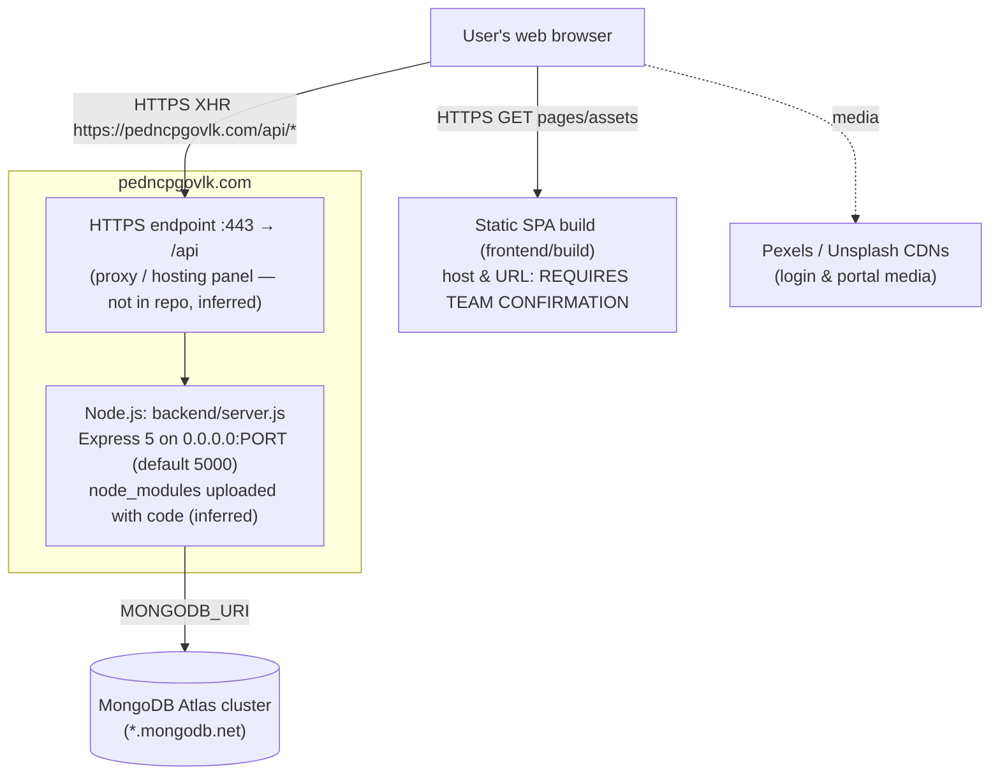

# 11 — Deployment and Production Environment

> **Revision R1 (after merging `main`, 2026-10-10).** The first pass found no deployment evidence: every API call targeted `http://127.0.0.1:5000`. The merged changes now give **partial deployment evidence**:
> - commit `f5b02c7` (2026-10-06, "npm run build cmmd") points all 109 frontend API calls at **`https://pedncpgovlk.com/api/...`**;
> - commit `3aed28f` commits a production build archive, `frontend/build.zip`;
> - commit `ab2ba6e` commits `backend/node_modules/`;
> - commit `1433a7e` adds `backend/.env.example` and a README with a manual deployment section.
>
> There is still **no hosting configuration, CI or infrastructure file**. Facts not shown by the repository stay marked **REQUIRES TEAM CONFIRMATION**.

## 11.1 Evidence Matrix

| # | Topic | Repository evidence | Status |
|---|---|---|---|
| 1 | Hosting platforms | None named anywhere (README and `docs/PROJECT_DOCUMENTATION.md` §16 say "No Docker, CI or hosting configuration is in the repository yet") | **REQUIRES TEAM CONFIRMATION** |
| 2 | Production API origin | `https://pedncpgovlk.com` (all paths `/api/...`) in 21 frontend files | **Verified (source)**. Whether it is live was not tested |
| 3 | Frontend hosting | CRA `npm run build` → static files. A built copy is committed as `frontend/build.zip` (built 2026-10-06 10:03). The frontend's own public URL is not stated anywhere | Platform and URL: **REQUIRES TEAM CONFIRMATION** |
| 4 | Backend hosting | `node server.js` on `PORT` (default 5000), binding `0.0.0.0`. The frontend URL has no port, so a proxy or hosting layer must map `https://pedncpgovlk.com/api` → Node | Reverse-proxy/panel set-up: **REQUIRES TEAM CONFIRMATION** (Inferred necessity) |
| 5 | `backend/node_modules` committed | 5,258 files force-added in `ab2ba6e` ("update cimit in node module") despite `.gitignore`. This suggests the backend was uploaded to a host where `npm install` was not run (e.g. file upload through a control panel) | **Inferred** — **REQUIRES TEAM CONFIRMATION** |
| 6 | Database hosting | MongoDB Atlas (`mongodb.net` host in the local `.env`); `.env.example` documents both local and Atlas URI formats | Verified (domain only) |
| 7 | Production build | `react-scripts build` (frontend); no backend build | Verified |
| 8 | Deployment configuration | None (no Dockerfile, Procfile, `vercel.json`, `netlify.toml`, nginx/Apache config, PM2 ecosystem file, `.htaccess`) | **Missing** |
| 9 | Environment variables | Backend: `MONGODB_URI`, `PORT`, `JWT_SECRET` (unused). Template: `backend/.env.example`. Frontend: none | Verified |
| 10 | HTTPS / domain | The frontend uses `https://` + the `pedncpgovlk.com` domain. TLS certificate and DNS set-up are not in the repository | Domain: Verified (source). TLS details: **REQUIRES TEAM CONFIRMATION** |
| 11 | CORS | `cors()` allow-all (any origin can call the production API) | Verified |
| 12 | Deployment scripts | Only DB utilities (`seedDefaultUsers.js`, `resetPassword.js`) | Verified |
| 13 | CI/CD | None | Verified absence |
| 14 | Logging / monitoring | `console.*` only | Verified |
| 15 | Backups | None in the repository | **REQUIRES TEAM CONFIRMATION** |
| 16 | Deployment records in git | 2026-10-06 commits: `3aed28f` (build.zip + login URLs), `ab2ba6e` (node_modules), `f5b02c7` "npm run build cmmd" (all URLs) | Verified |

## 11.2 The `build.zip` Inconsistency (important)

Unpacking `frontend/build.zip` and scanning its JavaScript (excluding source maps) gives:

| Target in compiled JS | Occurrences |
|---|---|
| `https://pedncpgovlk.com` | **2** (the two login calls only) |
| `http://127.0.0.1:5000` | **107** (every dashboard, `ProtectedRoute`, chat, risk panel, job details) |
| `http://localhost:5000` | 1 (legacy `api.js`) |

**Cause (Verified from git timestamps):** the archive was built at 10:03 and committed in `3aed28f` (13:44), when only `DivisionLogin.js` and `HeadOffice/Login.jsx` had been switched to the production domain. The remaining 107 URLs were switched later, in `f5b02c7` (14:39). No rebuilt archive was committed afterwards.

**Consequence if this archive were the deployed frontend:** login would succeed against production. Immediately afterwards, `ProtectedRoute` would call `http://127.0.0.1:5000/api/users/:id`, fail with no response, and show "Couldn't reach the server". No dashboard would load. If the live site works, it must have been built from the later source (`f5b02c7` or after).

→ **REQUIRES TEAM CONFIRMATION**: which build is deployed. Recommendation: delete `build.zip` from the repository (build artefacts belong in releases or the host, not in git), or replace it with a build from the current source.

## 11.3 Deployment Architecture (as evidenced after R1)



Elements labelled "inferred" follow from the URL format. They are not described anywhere in the repository.

## 11.4 Reproducible Deployment Procedure (based on the repository)

**Prerequisites:** Node.js (the analysis machine used v22.18.0; the README says "current LTS"; the production version is **REQUIRES TEAM CONFIRMATION**), npm, MongoDB (Atlas or local), git, and a host that can run Node and serve HTTPS for the API domain.

```bash
# 1. Clone
git clone https://github.com/Project-Managment-System/software-engineering-project.git
cd software-engineering-project

# 2. Backend configuration
cd backend
cp .env.example .env          # Windows PowerShell: Copy-Item .env.example .env
#   fill in MONGODB_URI (required), PORT (keep 5000 unless the proxy maps elsewhere)
npm install                   # (node_modules is also committed, but reinstalling is recommended)
node server.js                # ">>> CEMS DATABASE SYNCED: <host>", "[CORE]: Server active on port 5000"
#   keep it running with a process manager (e.g. pm2) — not configured in the repo

# 3. Seed initial accounts (first time only), then CHANGE every seeded password
node seedDefaultUsers.js
#   headoffice_admin: no seed/endpoint — insert directly in MongoDB (README states this)

# 4. Expose the API at https://<your-domain>/api  (reverse proxy / hosting panel, TLS certificate)

# 5. Frontend
cd ../frontend
#   the API origin is hard-coded: if not deploying to pedncpgovlk.com, replace it in all 21 files
#   (recommended: one REACT_APP_API_URL constant)
npm install
npm run build                 # output: frontend/build/
#   upload build/ to a static host; configure SPA fallback (all paths → index.html)

# 6. Tests
cd ../backend && npm test
```

## 11.5 Documentation Inconsistencies Found in R1 (for the team to fix)

| Location | Statement | Reality in code |
|---|---|---|
| README "Deployment" step 4 | "replace the hard-coded `127.0.0.1:5000` / `localhost:5000` API URLs … Otherwise the deployed site calls each visitor's own machine" | Already replaced with `https://pedncpgovlk.com` in source (only the legacy `api.js` keeps localhost) |
| README "Getting started" / API overview | Base URL `http://localhost:5000/api`; log in at `http://localhost:3000` | A local frontend now calls the **production** API, so local development edits production data unless the URLs are changed back |
| README / `.env.example` | "Keep PORT at 5000 — the frontend has this port hard-coded" | The frontend no longer contains a port |
| `docs/PROJECT_DOCUMENTATION.md` §5, §16 | Sentences such as "The frontend has ` https://pedncpgovlk.com` hard-coded" next to "keep the port at 5000", and "change the hard-coded ` https://pedncpgovlk.com` / `http://localhost:5000` URLs" | Artefacts of the same find-and-replace (note the leading space) |

## 11.6 Production Limitations (evidence-based)

1. The API origin is hard-coded (now production). There is no environment-based configuration, so developers running locally hit production.
2. **No authentication on a public API domain** (SEC-1): the most serious production risk.
3. No process manager, health-check endpoint or graceful shutdown in the repository. The process exits if the initial DB connection fails.
4. Polling load: each open dashboard sends 1–3 requests every 4–8 s to the production API.
5. Base64 files in MongoDB documents (16 MB per-document cap, large payloads over the internet).
6. The login and portal pages depend on external video and image CDNs.
7. No CI, so tests are not run automatically; the existing suite still fails 2 date-dependent tests (also acknowledged in the README).
8. Committed build artefact is stale (§11.2), and committed `node_modules` bloats the repository (5,258 files) and pins platform-specific binaries.
9. No log aggregation, alerting or backup procedure in the repository.
