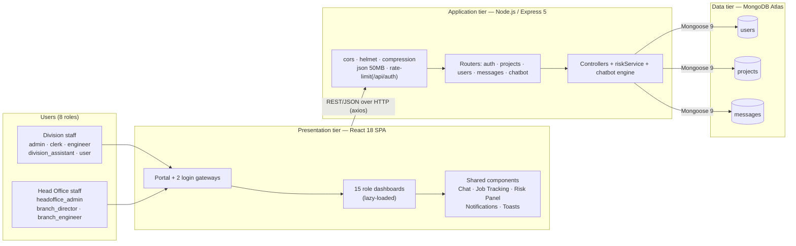
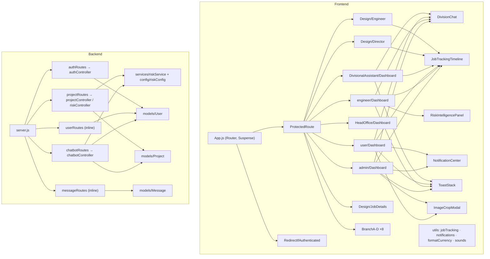
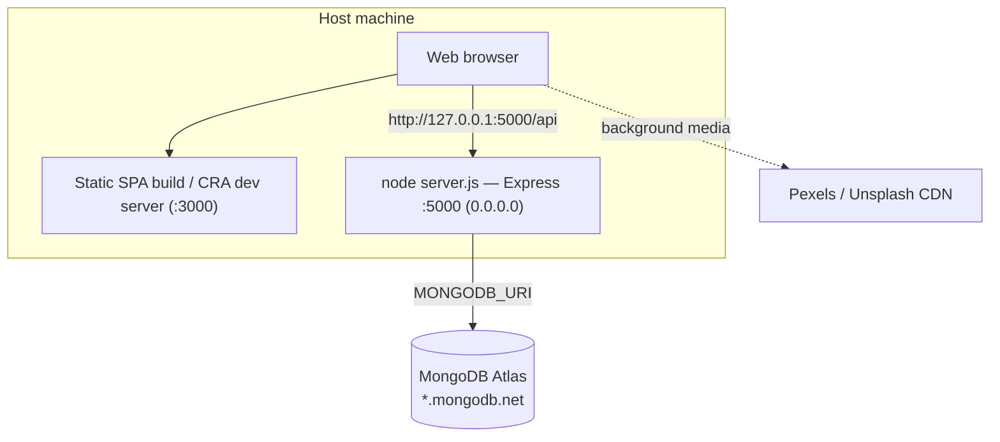
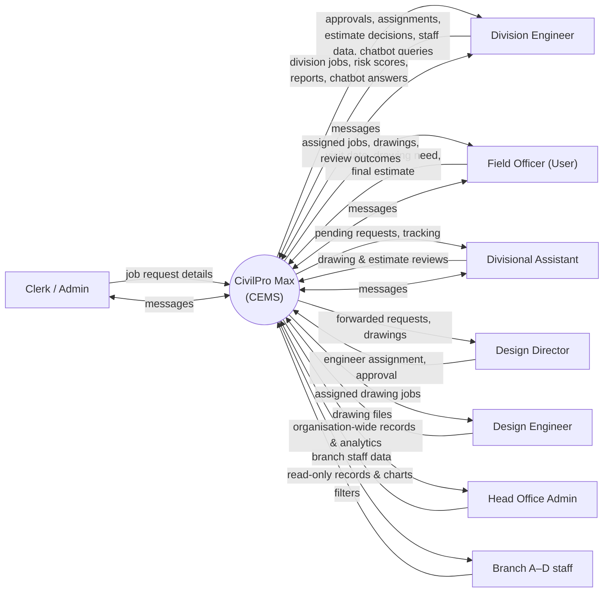
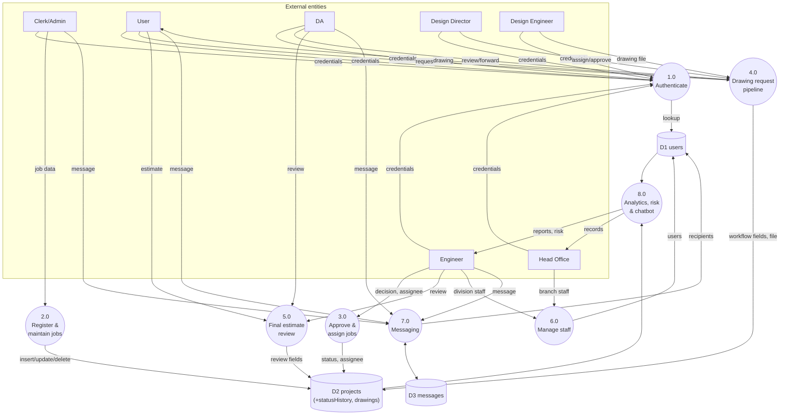
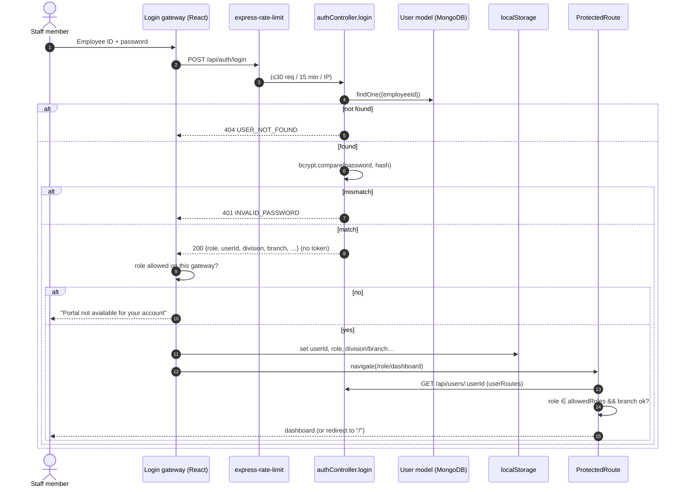
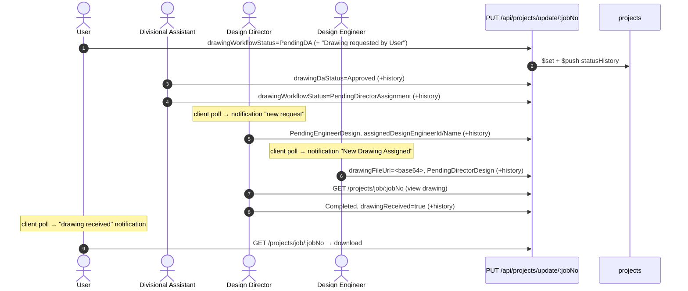
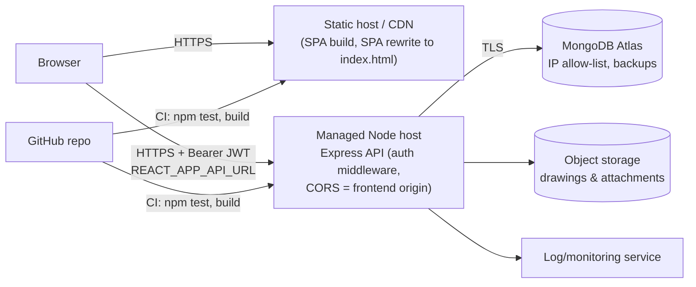

# 15 — Diagram Specifications (Mermaid sources)

All diagrams are drawn **only from verified code**. Each one lists its evidence. Render them with any Mermaid renderer (GitHub, mermaid.live, VS Code extension) and redraw in a diagramming tool if the report needs a house style.

---

## D-01 High-Level System Architecture

*Evidence:* `App.js`, `server.js`, `models/*`. *Explanation:* a three-tier MERN application. Note there is no auth service; the gateways only route users.

## D-02 Component Diagram

## D-03 Deployment Diagram (as supported by committed code)

*Note:* the production topology is **REQUIRES TEAM CONFIRMATION** (`11`). D-12 shows the recommended target.

## D-04 Data Flow Diagram — Level 0 (Context)

## D-05 Data Flow Diagram — Level 1

## D-06 Authentication Sequence

## D-07 Drawing Request Pipeline — Sequence

## D-08 Final Estimate Review — Sequence
(Same as `09` WF-5. Copy from there.)

## D-09 Drawing Workflow — State Machine
(Same as `09` WF-4 state diagram. Copy from there.)

## D-10 Entity Relationship Diagram
(Same as `06` §6.2. Copy from there.) Notation: solid relationships are ObjectId refs; dotted relationships are string-match joins done in application code. MongoDB enforces neither.

## D-11 Job Status State Machine
(Same as `06` §6.5.) Mark `Ongoing` and `Completed` as "defined in schema, not reachable from UI".

## D-12 Recommended Target Deployment (FUTURE — NOT IMPLEMENTED)

**Label clearly as a proposal** in the report.

## D-13 Use-Case Diagram (text spec; draw in a UML tool)

| Actor | Use cases |
|---|---|
| Clerk / Admin | Log in; Register job; Edit job; Delete job; View/filter jobs; Export report; Track job; Message (clerk); View notifications (clerk); Manage profile |
| Engineer | Log in; Approve/reject job; Undo decision; Assign field officer; Review final estimate; Manage division staff; View risk intelligence; Query AI assistant; View progress report; Track drawings; Track job; Message; Export |
| Divisional Assistant | Log in; Review drawing request; Forward request; Review final estimate; View division users/jobs; Track drawings; Track job; Message |
| User (field officer) | Log in; View assigned jobs; Confirm field visit; Declare drawing need; Request/undo drawing; Download drawing; Submit final estimate; View notifications; Track job; Message |
| Design Director | Log in; Assign design engineer; Re-assign; View attachment; Approve drawing; View completed; View notifications; Track job; Open job details |
| Design Engineer | Log in; Attach drawing; Recall drawing; View analytics; View notifications; Track job |
| Head Office Admin | Log in; View organisation analytics; View all records; Create/edit/delete branch staff |
| Branch A–D staff | Log in; View analytics; View/filter records; Change password |
| «include» | "Track job" includes "View statusHistory". "Approve drawing" includes "View attachment" |
