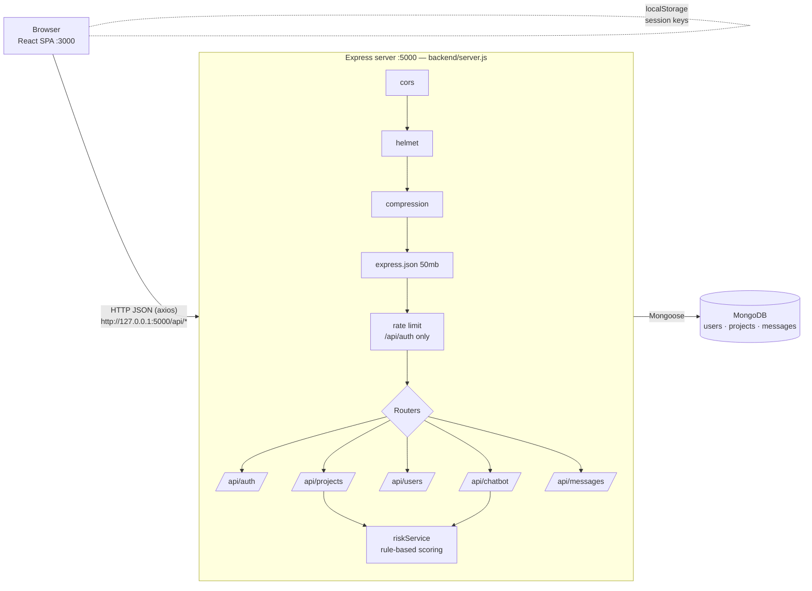
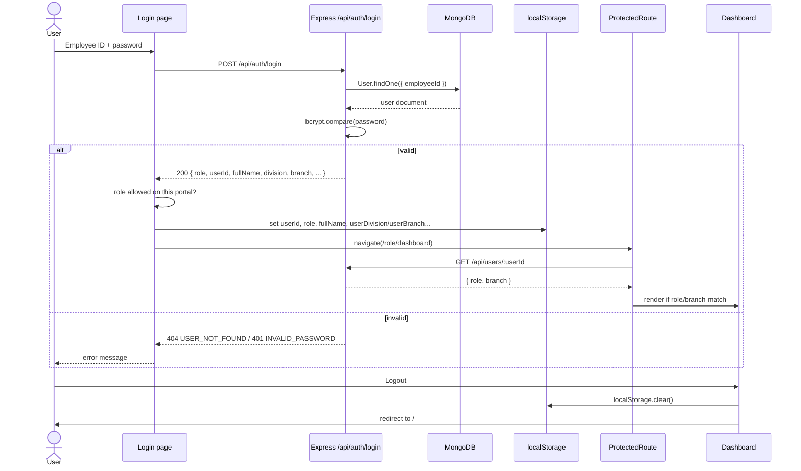
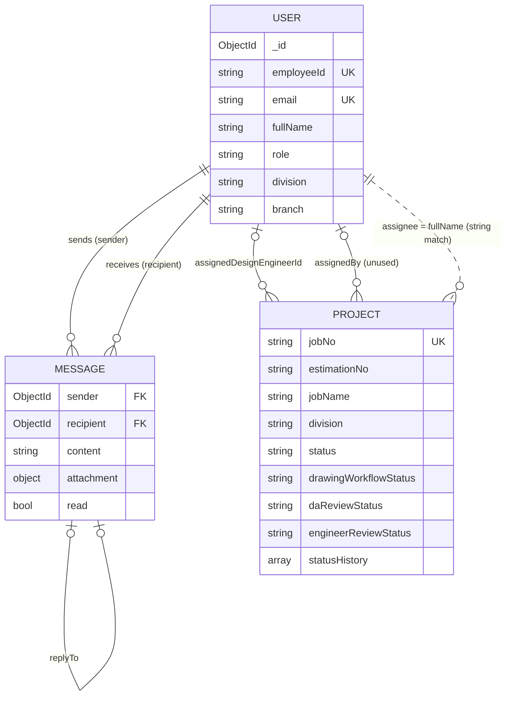
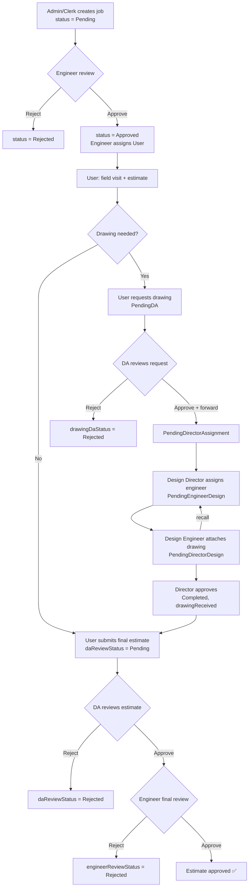

# CEMS — Civil Engineering Management System: Project Documentation

> This document describes the system exactly as it is implemented in this repository.
> Everything here was read from the source code. Where the code does not answer a question,
> the text says **"Not found in code"** or lists the question in [Open questions](#20-open-questions).
>
> Related documents: [README.md](../README.md) · [RISK_INTELLIGENCE.md](RISK_INTELLIGENCE.md)

---

## Table of contents

1. [Project overview](#1-project-overview)
2. [Tech stack](#2-tech-stack)
3. [System architecture](#3-system-architecture)
4. [Folder structure](#4-folder-structure)
5. [Setup and installation](#5-setup-and-installation)
6. [User roles and permissions](#6-user-roles-and-permissions)
7. [Authentication flow](#7-authentication-flow)
8. [Frontend routes](#8-frontend-routes)
9. [Frontend pages and features](#9-frontend-pages-and-features)
10. [Shared components and utilities](#10-shared-components-and-utilities)
11. [Backend API reference](#11-backend-api-reference)
12. [Database models](#12-database-models)
13. [Business workflows](#13-business-workflows)
14. [Security](#14-security)
15. [Testing](#15-testing)
16. [Deployment](#16-deployment)
17. [Troubleshooting and FAQ](#17-troubleshooting-and-faq)
18. [Contributing](#18-contributing)
19. [Glossary](#19-glossary)
20. [Open questions](#20-open-questions)

---

## 1. Project overview

**CEMS (Civil Engineering Management System)** is a web application for a provincial
engineering organization. It tracks civil-engineering jobs (construction and repair
requests from government ministries and departments) from the moment a job is
registered until its estimate and structural drawing are approved. The backend logs
itself as "CEMS" ([config/db.js](../backend/config/db.js)), and the chatbot calls itself
"CEMS AI Assistant".

### Who uses it

The system has two sides, and the home page ([Portal.jsx](../frontend/src/pages/Portal.jsx))
offers one login portal for each:

| Portal | Organizational unit | Users |
|---|---|---|
| **Division** | Eight engineering divisions: Anuradhapura-East, Anuradhapura-West, Medawachchiya, Mihinthale, Kekirawa, Thambuttegama, Polonnaruwa, Hingurakgoda | Admin / Clerk, Division Engineer, Divisional Assistant, User (field staff) |
| **Head Office** | Head Office plus five branches: Design, Admin (`branch-a`), Accounts (`branch-b`), Works (`branch-c`), Procurements (`branch-d`) | Head Office admin, Branch Engineers, Branch Directors |

Each division covers several **DS divisions** (Divisional Secretariat areas). For example,
the **Kekirawa** division covers Kekirawa, Thirappane, Ipalogama, Palugaswewa and Palagala
(see `DIVISION_DS_DIVISIONS` in [admin/Dashboard.jsx](../frontend/src/pages/admin/Dashboard.jsx)).

### Problems it solves

- **Job registration with official numbering.** Every job gets a unique Job No. (`JB-1234`)
  and an Estimation No. built from the official code list (e.g. `26-KEK-612-N-01`).
- **Division-scoped work.** Each engineer, assistant and user only sees their own division's jobs.
- **Review pipeline.** The job moves through a defined chain: the engineer approves it,
  field staff estimate it, the Divisional Assistant reviews it, the Design branch produces
  the drawing, and the engineer does the final review.
- **Audit trail.** Every important step is recorded in a per-job timeline ("Job Tracking").
- **Oversight.** Charts, PDF exports, a rule-based risk score for each job, and a chatbot
  that answers questions about a division's jobs.
- **Communication.** Built-in one-to-one messaging with attachments between staff in a division.

---

## 2. Tech stack

### Frontend ([frontend/package.json](../frontend/package.json))

| Library | Version | Used for |
|---|---|---|
| react / react-dom | ^18.2.0 | UI framework |
| react-scripts | ^5.0.1 | Create React App build/dev tooling |
| react-router-dom | ^6.15.0 | Client-side routing ([App.js](../frontend/src/App.js)) |
| axios | ^1.6.0 | HTTP calls to the backend |
| @tanstack/react-query | ^5.90.20 | Listed as a dependency; **no imports found in `src/`** |
| recharts | ^2.7.2 | Bar and pie charts on dashboards |
| jspdf / jspdf-autotable | ^4.2.1 / ^5.0.8 | PDF report export |
| framer-motion | ^10.18.0 | Page and card animations |
| lucide-react, react-icons, remixicon | ^0.563.0, ^5.5.0, ^4.9.1 | Icons |
| react-easy-crop | ^6.2.3 | Profile-picture cropping ([ImageCropModal.jsx](../frontend/src/components/ImageCropModal.jsx)) |
| animate.css | ^4.1.1 | CSS animations |
| web-vitals | ^5.1.0 | Performance reporting ([reportWebVitals.js](../frontend/src/reportWebVitals.js)) |
| tailwindcss / postcss / autoprefixer | ^3.4.19 / ^8.5.6 / ^10.4.23 | Utility CSS (dev dependencies) |

### Backend ([backend/package.json](../backend/package.json))

| Library | Version | Used for |
|---|---|---|
| express | ^5.2.1 | HTTP server and routing |
| mongoose | ^9.9.1 | MongoDB object modeling |
| bcryptjs | ^3.0.3 | Password hashing (12 salt rounds) |
| jsonwebtoken | ^9.0.3 | Listed as a dependency; **not used anywhere in the code** (see [Security](#14-security)) |
| helmet | ^8.3.0 | Security HTTP headers |
| cors | ^2.8.6 | Cross-origin requests (allow-all) |
| compression | ^1.8.1 | Gzip compression of responses |
| express-rate-limit | ^8.6.2 | Rate limiting on `/api/auth` |
| dotenv | ^17.2.3 | Loads `.env` |
| jest | ^30.4.2 | Unit tests (dev dependency) |

**Database:** MongoDB (the connection string comes from the `MONGODB_URI` environment variable).

---

## 3. System architecture

The system is a classic three-tier setup: a React single-page app talks to an Express REST
API over HTTP/JSON, and the API reads and writes MongoDB through Mongoose.



Key points:

- **The API base URL is hard-coded** in the frontend as `http://127.0.0.1:5000` (most
  pages) or `http://localhost:5000/api` ([api/api.js](../frontend/src/api/api.js)). No
  environment variable is used for it.
- **Nothing is pushed from the server in real time.** Dashboards poll: unread-message
  counts every 4–6 seconds, and the Admin dashboard reloads its data every 8 seconds.
- **Files (drawings, chat attachments, profile pictures) are stored as base64 strings**
  inside MongoDB documents. There is no separate file storage.
- **Notifications are built in the browser** from the job data
  ([utils/notifications.js](../frontend/src/utils/notifications.js)). There is no
  notification collection on the server.

---

## 4. Folder structure

Only source folders are shown. `node_modules/`, build output and the `*_files` folders
(saved web-page assets, not project code) are left out.

```text
software-engineering-project/
├── README.md                     Placeholder readme (title only)
├── docs/
│   ├── RISK_INTELLIGENCE.md      Risk-scoring methodology
│   └── PROJECT_DOCUMENTATION.md  This file
├── backend/
│   ├── server.js                 App entry: middleware, rate limit, route mounting, error handler
│   ├── seedDefaultUsers.js       One-time script that creates 8 engineers + 1 admin
│   ├── config/
│   │   ├── db.js                 MongoDB connection (exits the process on failure)
│   │   └── riskConfig.js         Risk weights, thresholds and saturation constants
│   ├── controllers/
│   │   ├── authController.js     enroll + login
│   │   ├── projectController.js  Job CRUD, status, undo, Job/Estimation No. generation
│   │   ├── riskController.js     Risk endpoints (single job + summary)
│   │   └── chatbotController.js  Rule-based chatbot (intent detection + reports)
│   ├── middleware/
│   │   └── authMiddleware.js     Only `preventCache` (no-cache headers); not mounted anywhere
│   ├── models/
│   │   ├── User.js               Users and roles, password hashing, uniqueness rules
│   │   ├── Project.js            Jobs and the full workflow state
│   │   └── Message.js            Direct messages
│   ├── routes/
│   │   ├── authRoutes.js         /api/auth
│   │   ├── projectRoutes.js      /api/projects (plus an inline /assign handler)
│   │   ├── userRoutes.js         /api/users (handlers are written inline)
│   │   ├── messageRoutes.js      /api/messages (handlers are written inline)
│   │   └── chatbotRoutes.js      /api/chatbot
│   ├── services/
│   │   └── riskService.js        Pure risk-scoring functions
│   ├── utils/
│   │   └── escapeRegex.js        Escapes user text before it is used in a RegExp
│   └── tests/
│       └── riskService.test.js   Jest unit tests for riskService
└── frontend/
    ├── public/                   index.html, favicon, manifest, civil_engineering_bg.png
    ├── tailwind.config.js, postcss.config.js
    └── src/
        ├── index.js              React root; imports global CSS
        ├── App.js                All routes (dashboards are lazy-loaded)
        ├── App.css, index.css    Global styles
        ├── api/api.js            axios instance + registerUser/loginUser
        ├── components/           Shared UI (see section 10)
        ├── constants/branches.js The 5 Head Office branches (slug → label)
        ├── context/              AuthContext.js, ThemeContext.js (both unused)
        ├── styles/premium-system.css  Shared "premium" design system (buttons, glass effects)
        ├── utils/                buttonEffects, formatCurrency, jobTracking, notifications, sounds
        └── pages/
            ├── Portal.jsx               Home page with the two login portals
            ├── DivisionLogin.js         Unified division login
            ├── admin/                   Admin/Clerk dashboard (+ legacy Login.jsx)
            ├── engineer/                Division Engineer dashboard (+ legacy Login.jsx)
            ├── user/                    User (field staff) dashboard (+ legacy Login.jsx)
            ├── DivisionalAssistant/     DA dashboard (Login.jsx is an empty file)
            ├── HeadOffice/              Head Office login + dashboard
            ├── Design/                  Design branch Engineer/Director dashboards + JobDetails
            ├── BranchA … BranchD/       Engineer + Director dashboards (identical code per branch)
            └── shared/BranchDashboard.css  Styles shared by the branch dashboards
```

---

## 5. Setup and installation

### Prerequisites

- **Node.js** with npm. The exact version is not pinned in the code; a current LTS release
  works with Express 5 and React 18.
- **MongoDB**, either a local server or a hosted cluster.
- **Git**

### 1. Clone

```bash
git clone <repository-url>
cd software-engineering-project
```

### 2. Backend

```bash
cd backend
npm install
```

Create `backend/.env` (this file is git-ignored):

| Variable | Required | Used in | Example |
|---|---|---|---|
| `MONGODB_URI` | Yes | [config/db.js](../backend/config/db.js), [seedDefaultUsers.js](../backend/seedDefaultUsers.js) | `mongodb://127.0.0.1:27017/civilManagement` |
| `PORT` | No (default `5000`) | [server.js](../backend/server.js) | `5000` |
| `JWT_SECRET` | Present in `.env`, **but no code reads it** | — | `change-me` |

> Keep the port at **5000**. The frontend has `http://127.0.0.1:5000` hard-coded.

Start the server. There is no `start` script in `package.json`, so run Node directly:

```bash
node server.js
# Expected log: ">>> CEMS DATABASE SYNCED: <host>" and "[CORE]: Server active on port 5000"
```

### 3. Seed the default users

```bash
node seedDefaultUsers.js
```

This creates the following accounts. It is safe to re-run, because existing employee IDs
are skipped. Passwords are hashed automatically.

| Employee ID | Password | Role | Division |
|---|---|---|---|
| enae1 | ae1 | engineer | Anuradhapura-East |
| enaw1 | aw1 | engineer | Anuradhapura-West |
| enme1 | me1 | engineer | Medawachchiya |
| enmi1 | mi1 | engineer | Mihinthale |
| enth1 | th1 | engineer | Thambuththegama ⚠️ |
| enke1 | ke1 | engineer | Kekirawa |
| enpo1 | po1 | engineer | Polonnaruwa |
| enhi1 | hi1 | engineer | Higurakgoda ⚠️ |
| cl0001 | cl1 | admin | — |

⚠️ Two seeded division names are spelled differently from the rest of the app
(`Thambuttegama`, `Hingurakgoda`). Because job queries match the division name exactly,
these two engineers will not see jobs created with the correct spelling. See
[Open questions](#20-open-questions).

Change these weak passwords after the first login. Emails are placeholders (`<id>@cems.local`).

**Head Office admin (`headoffice_admin`) accounts:** no seed script or API endpoint
creates this role. You have to insert it directly into MongoDB. Branch staff are then
created from the Head Office dashboard.

### 4. Frontend

```bash
cd ../frontend
npm install
npm start          # dev server at http://localhost:3000
```

### 5. Production build

```bash
cd frontend
npm run build      # outputs frontend/build/
```

See [Deployment](#16-deployment) for serving it.

---

## 6. User roles and permissions

Roles are defined by the `role` enum in [User.js](../backend/models/User.js).

| Role | Who | Logs in via | Lands on | Created by |
|---|---|---|---|---|
| `admin` | System administrator / clerk account | Division portal | `/admin/dashboard` | Seed script |
| `clerk` | Division clerk | Division portal | `/admin/dashboard` | Engineer ("Add User") |
| `engineer` | Division Engineer (at most **one per division**) | Division portal | `/engineer/dashboard` | Seed script |
| `division_assistant` | Divisional Assistant (DA) | Division portal | `/divisional-assistant/dashboard` | Engineer ("Add User") |
| `user` | Field staff who do site visits and estimates | Division portal | `/user/dashboard` | Engineer ("Add User") |
| `headoffice_admin` | Head Office administrator | Head Office portal | `/headoffice/dashboard` | Manual database insert |
| `branch_engineer` | Engineer in a Head Office branch | Head Office portal | `/<branch>/engineer/dashboard` | Head Office ("Assign Staff") |
| `branch_director` | Director of a branch (at most **one per branch**) | Head Office portal | `/<branch>/director/dashboard` | Head Office ("Assign Staff") |

Rules enforced by the model:
- `division` is required for every role except `admin`, `headoffice_admin`, `branch_engineer` and `branch_director`.
- `branch` (`design`, `branch-a` … `branch-d`) is required for `branch_engineer` and `branch_director`.
- A division can have only one `engineer`, and a branch only one `branch_director` (checked in the `pre('save')` hook).
- The employee account with ID `cl0004` has **unrestricted division access** in the Admin
  dashboard's New Job form. It is hard-coded in `UNRESTRICTED_DIVISION_EMPLOYEE_IDS`.

### Role-to-feature matrix

✅ = can do · 👁 = view only · — = no access

| Feature | admin/clerk | engineer | DA | user | HO admin | Design Director | Design Engineer | Branch A–D Eng/Dir |
|---|---|---|---|---|---|---|---|---|
| Create / edit job | ✅ | ✅ edit | — | — | — | — | — | — |
| Delete job | ✅ | ✅ | — | — | — | — | — | — |
| Approve / reject job | — | ✅ (+ undo) | — | — | — | — | — | — |
| Assign job to a user | — | ✅ | — | — | — | — | — | — |
| Field visit & estimate | — | — | — | ✅ | — | — | — | — |
| Request drawing | — | — | — | ✅ | — | — | — | — |
| Approve/reject drawing request, forward to Design | — | — | ✅ | — | — | — | — | — |
| Review final estimate (first stage) | — | — | ✅ | — | — | — | — | — |
| Review final estimate (final stage) | — | ✅ (+ undo) | — | — | — | — | — | — |
| Assign Design Engineer, approve drawing | — | — | — | — | — | ✅ | — | — |
| Attach drawing / recall | — | — | — | — | — | — | ✅ | — |
| Add / edit / delete division staff | — | ✅ | 👁 My Users | — | — | — | — | — |
| Add / edit / delete branch staff | — | — | — | — | ✅ | — | — | — |
| Job Tracking timeline | ✅ | ✅ | ✅ | ✅ | — | ✅ | ✅ | — |
| Risk Intelligence panel | — | ✅ | — | — | — | — | — | — |
| AI chatbot | — | ✅ | — | — | — | — | — | — |
| Messaging (DivisionChat) | ✅ | ✅ | ✅ | ✅ | — | — | — | — |
| All-division records (charts) | — | — | — | — | 👁 | 👁 | 👁 | 👁 |
| Profile / change password | ✅ | ✅ | ✅ ⚠️ | ✅ | ✅ | ✅ | ✅ | ✅ password |
| PDF export | ✅ | ✅ | ✅ | ✅ | — | ✅ | — | — |

⚠️ The DA dashboard calls `PATCH /api/users/:id/change-password`, which does not exist.
The correct endpoint is `/password`, so password changes from the DA dashboard fail.

> **Important:** these permissions are enforced **only in the frontend** (which buttons
> each dashboard shows). The backend API does not check who is calling. See [Security](#14-security).

---

## 7. Authentication flow

### Login pages

| Page | Route | Accepted roles | File |
|---|---|---|---|
| Division login | `/division/login` | admin, clerk, engineer, user, division_assistant | [DivisionLogin.js](../frontend/src/pages/DivisionLogin.js) |
| Head Office login | `/headoffice/login` | headoffice_admin, branch_engineer, branch_director | [HeadOffice/Login.jsx](../frontend/src/pages/HeadOffice/Login.jsx) |
| Legacy logins | `/admin/login`, `/engineer/login`, `/user/login` | the matching role | `pages/*/Login.jsx` (not linked from the Portal) |

Users log in with their **Employee ID** and password, not their email.

### What happens

1. The login page sends `POST /api/auth/login` with `{ employeeId, password }`.
2. The backend finds the user, checks the password with bcrypt, and returns the user's
   profile: `role`, `userId`, `employeeId`, `fullName`, `email`, `division`, `branch`, `profilePic`.
   **No JWT or session token is issued.** The `jsonwebtoken` package and `JWT_SECRET` are unused.
3. The page checks that the role belongs to this portal. Only then does it write the session to `localStorage`:

| localStorage key | Value |
|---|---|
| `userId` | MongoDB `_id` |
| `employeeId`, `fullName`, `email`, `role`, `profilePic` | From the login response |
| `userDivision` | Division (division portal) |
| `userBranch` | Branch slug (Head Office portal) |
| `isAdmin` | `"true"` for admin/clerk |
| `isAuthenticated` | `"true"` for user, DA and Head Office roles |

4. The page navigates to the role's dashboard.

### Route guards

- **[ProtectedRoute.js](../frontend/src/components/ProtectedRoute.js)** wraps every dashboard.
  It reads `userId` and `role` from localStorage, then calls `GET /api/users/:userId` to
  confirm that the user exists and has an allowed role (and the right branch, if one is
  required). If not, it clears the session and redirects to `/`. If the server can't be
  reached, it shows "Couldn't reach the server" and keeps the session.
- **[RedirectIfAuthenticated.js](../frontend/src/components/RedirectIfAuthenticated.js)**
  wraps the Portal and the login pages. If a session exists in localStorage, it redirects
  straight to that role's dashboard, so a logged-in user never sees a login form again.

### Logout

Each dashboard calls `localStorage.clear()` and navigates to `/`.



### Backend auth middleware

[authMiddleware.js](../backend/middleware/authMiddleware.js) exports only `preventCache`,
which sets no-cache headers. **It is not mounted on any route.** No backend middleware
authenticates requests.

---

## 8. Frontend routes

All routes are in [App.js](../frontend/src/App.js). Every dashboard is lazy-loaded with `React.lazy`.

| Path | Component | Guard | Allowed roles | Required branch | Purpose |
|---|---|---|---|---|---|
| `/` | `Portal` + `Footer` | RedirectIfAuthenticated | public | — | Home page with the Head Office and Division portals |
| `/division/login` | `DivisionLogin` | RedirectIfAuthenticated | public | — | Division login |
| `/headoffice/login` | `HeadOffice/Login` | RedirectIfAuthenticated | public | — | Head Office and branch login |
| `/headoffice/dashboard` | `HeadOffice/Dashboard` | ProtectedRoute | headoffice_admin | — | Head Office dashboard |
| `/design/engineer/dashboard` | `Design/Engineer/Dashboard` | ProtectedRoute | branch_engineer | design | Produce drawings |
| `/design/director/dashboard` | `Design/Director/Dashboard` | ProtectedRoute | branch_director | design | Assign engineers, approve drawings |
| `/design/job/:jobNo` | `Design/JobDetails` | ProtectedRoute | branch_engineer, branch_director, engineer, division_assistant | — | Full details of one job |
| `/branch-a/engineer/dashboard` | `BranchA/Engineer/Dashboard` | ProtectedRoute | branch_engineer | branch-a | Admin branch engineer |
| `/branch-a/director/dashboard` | `BranchA/Director/Dashboard` | ProtectedRoute | branch_director | branch-a | Admin branch director |
| `/branch-b/engineer/dashboard` | `BranchB/Engineer/Dashboard` | ProtectedRoute | branch_engineer | branch-b | Accounts branch engineer |
| `/branch-b/director/dashboard` | `BranchB/Director/Dashboard` | ProtectedRoute | branch_director | branch-b | Accounts branch director |
| `/branch-c/engineer/dashboard` | `BranchC/Engineer/Dashboard` | ProtectedRoute | branch_engineer | branch-c | Works branch engineer |
| `/branch-c/director/dashboard` | `BranchC/Director/Dashboard` | ProtectedRoute | branch_director | branch-c | Works branch director |
| `/branch-d/engineer/dashboard` | `BranchD/Engineer/Dashboard` | ProtectedRoute | branch_engineer | branch-d | Procurements branch engineer |
| `/branch-d/director/dashboard` | `BranchD/Director/Dashboard` | ProtectedRoute | branch_director | branch-d | Procurements branch director |
| `/admin/login` | `admin/Login` | RedirectIfAuthenticated | public | — | Legacy admin login |
| `/admin/dashboard` | `admin/Dashboard` | ProtectedRoute | admin, clerk | — | Admin/Clerk dashboard |
| `/engineer/login` | `engineer/Login` | RedirectIfAuthenticated | public | — | Legacy engineer login |
| `/engineer/dashboard` | `engineer/Dashboard` | ProtectedRoute | engineer | — | Division Engineer dashboard |
| `/user/login` | `user/Login` | RedirectIfAuthenticated | public | — | Legacy user login |
| `/user/dashboard` | `user/Dashboard` | ProtectedRoute | user | — | User dashboard |
| `/divisional-assistant/dashboard` | `DivisionalAssistant/Dashboard` | ProtectedRoute | division_assistant | — | DA dashboard |

There is no catch-all (404) route. An unknown URL renders an empty page.

---

## 9. Frontend pages and features

Features common to almost every dashboard:
- A collapsible sidebar with tabs, light/dark mode, and five accent themes (Violet, Ocean,
  Emerald, Rose, Amber). Theme choices are saved per dashboard in localStorage.
- **Profile** (edit name, email, phone and profile picture) and **Settings** (change password, sound preferences).
- Toast pop-ups ([ToastStack](../frontend/src/components/ToastStack.jsx)) and UI sounds ([sounds.js](../frontend/src/utils/sounds.js)).
- Charts built with Recharts.

### Portal — [Portal.jsx](../frontend/src/pages/Portal.jsx)
The home page with two cards: **Head Office** → `/headoffice/login` and **Division** → `/division/login`.

### Admin / Clerk — [admin/Dashboard.jsx](../frontend/src/pages/admin/Dashboard.jsx)
| Tab | What it does |
|---|---|
| Overview | Job statistics, bar and pie charts, job list with edit/delete, PDF export |
| New Job | Create or edit a job: name, ministry, department, institute, work type (N/R), allocation, date requested, reference, dept ID, source, DS division, remark. The division is locked to the clerk's own division unless the account has unrestricted access |
| Job Tracking | Status timeline for each job ([JobTrackingTimeline](../frontend/src/components/JobTrackingTimeline.jsx)) |
| Messages | DivisionChat |
| Notifications | NotificationCenter |
| Profile / Settings | Profile, picture and password |

API calls: `POST /projects/add`, `PUT /projects/update/:jobNo`, `DELETE /projects/delete/:jobNo`,
`GET /users/:id`, `PATCH /users/:id/profile`, `PATCH /users/:id/password`, `GET /messages/unread/:id`.
Polling: unread messages every 4 s, job data every 8 s.

### Division Engineer — [engineer/Dashboard.jsx](../frontend/src/pages/engineer/Dashboard.jsx)
| Tab | What it does |
|---|---|
| Overview | Division statistics and charts |
| My Jobs | Pending jobs to **Approve / Reject** (with undo); assign each job to a user |
| All Jobs | Every job in the division; edit/delete; PDF export |
| Drawing Tracking | Follow each job's drawing workflow status |
| Review Final Estimates | Approve or reject DA-approved estimates, with an optional note (with undo) |
| Job Tracking | Timeline for each job |
| Add User | Create, edit and delete division staff (roles: division_assistant, user, clerk) |
| View Progress | Per-user workload and progress of assigned jobs |
| AI Assistant | Chatbot (`POST /chatbot/query`) |
| Messages / Profile / Settings | — |

Also shows the **Risk Intelligence panel** ([RiskIntelligencePanel](../frontend/src/components/RiskIntelligencePanel.jsx)).
API calls: `GET /projects/division/:division`, `PATCH /projects/status|undo|undo-engineer-review|assign/:jobNo`,
`PUT /projects/update/:jobNo`, `DELETE /projects/delete/:jobNo`, `GET /users`, `GET /users/division/:division`,
`POST /users/add`, `PUT /users/:id`, `DELETE /users/:id`, `POST /chatbot/query`, plus profile/password/unread.

### User (field staff) — [user/Dashboard.jsx](../frontend/src/pages/user/Dashboard.jsx)
| Tab | What it does |
|---|---|
| Overview | The user's own statistics |
| My Jobs | Jobs whose `assignee` equals the user's full name |
| Update Progress | Record the field visit date and field estimate; choose whether a drawing is needed; request a drawing (or cancel the request); submit the final estimate cost and date |
| Job Tracking / Notifications / Messages / Profile / Settings | — |

API calls: `GET /projects/division/:division`, `GET /projects/job/:jobNo` (to download the
drawing), `PUT /projects/update/:jobNo`, plus profile/password/unread. Uses `ImageCropModal`
for the profile picture.

### Divisional Assistant — [DivisionalAssistant/Dashboard.jsx](../frontend/src/pages/DivisionalAssistant/Dashboard.jsx)
| Tab | What it does |
|---|---|
| Overview | Division statistics |
| My Users | Staff in the division |
| View Jobs | All jobs in the division |
| Drawing Requests | Approve or reject users' drawing requests (with undo); forward approved requests to the Design Director |
| Drawing Tracking | Drawing workflow status |
| Review Final Estimates | Approve or reject users' final estimates (with undo) |
| Job Tracking / Messages / Profile / Settings | — |

API calls: `GET /projects/division/:division`, `GET /users/division/:division`, `PUT /projects/update/:jobNo`,
`PATCH /users/:id/change-password` ⚠️ (endpoint doesn't exist), plus profile/unread.

### Head Office — [HeadOffice/Dashboard.jsx](../frontend/src/pages/HeadOffice/Dashboard.jsx)
| Tab | What it does |
|---|---|
| Overview | Statistics and charts across all divisions |
| All Records | Every job in the system |
| Branches | The five branches and their staff |
| Assign Staff | Create, edit and delete branch engineers and directors (`POST /users/branch-add`, `PUT/DELETE /users/:id`) |
| Settings | Password |

### Design Director — [Design/Director/Dashboard.jsx](../frontend/src/pages/Design/Director/Dashboard.jsx)
| Tab | What it does |
|---|---|
| Overview / Notifications | Summary and alerts |
| Assign Engineer | Jobs in `PendingDirectorAssignment`: pick a Design Engineer (sets `PendingEngineerDesign`); reassign |
| Pending Approvals | Jobs in `PendingDirectorDesign`: view and **approve** the drawing (sets `Completed` and `drawingReceived: true`) |
| Completed Jobs | Finished drawings; PDF export |
| Job Tracking / Profile / Settings | — |

API calls: `GET /projects/all`, `GET /projects/job/:jobNo`, `PUT /projects/update/:jobNo`, `GET /users`, plus profile/password.

### Design Engineer — [Design/Engineer/Dashboard.jsx](../frontend/src/pages/Design/Engineer/Dashboard.jsx)
| Tab | What it does |
|---|---|
| Overview / Notifications | Summary |
| Pending Jobs | Jobs assigned to this engineer: attach the drawing file (sets `PendingDirectorDesign`) or **recall** it before the Director approves |
| Completed Jobs / Job Tracking / Profile / Settings | — |

### Job Details — [Design/JobDetails.jsx](../frontend/src/pages/Design/JobDetails.jsx)
The full record of a single job, including the drawing (`GET /projects/job/:jobNo`) and
the division's staff (`GET /users/division/:division`).

### Branch A–D Engineer / Director — e.g. [BranchA/Engineer/Dashboard.jsx](../frontend/src/pages/BranchA/Engineer/Dashboard.jsx)
Eight near-identical files that differ only in their names and theme storage keys. Each has
three tabs: **Overview** (charts), **All Records** (read-only list from `GET /projects/all`)
and **Settings** (`PATCH /users/:id/password`). They have no workflow actions yet.

---

## 10. Shared components and utilities

### `src/components`
| File | Purpose | Used by |
|---|---|---|
| [ProtectedRoute.js](../frontend/src/components/ProtectedRoute.js) | Verifies the session against the backend before rendering a dashboard | App.js |
| [RedirectIfAuthenticated.js](../frontend/src/components/RedirectIfAuthenticated.js) | Sends logged-in users from public pages to their dashboard; exports `getDashboardPathForSession()` | App.js |
| [DivisionChat.jsx](../frontend/src/components/DivisionChat.jsx) (+ .css) | 1-to-1 messaging with replies, deletion, attachments (5 MB max), unread badges and conversation previews; polls regularly | admin, engineer, user, DA |
| [JobTrackingTimeline.jsx](../frontend/src/components/JobTrackingTimeline.jsx) | Renders a job's `statusHistory` as a timeline | admin, engineer, user, DA, Design |
| [RiskIntelligencePanel.jsx](../frontend/src/components/RiskIntelligencePanel.jsx) (+ .css) | Shows the output of `GET /api/projects/risk/summary` | engineer |
| [NotificationCenter.jsx](../frontend/src/components/NotificationCenter.jsx) | Notification list with categories and priorities | admin, user |
| [ToastStack.jsx](../frontend/src/components/ToastStack.jsx) | Stacked toast messages | admin, engineer, user, DA |
| [ImageCropModal.jsx](../frontend/src/components/ImageCropModal.jsx) | Crop tool for profile pictures (react-easy-crop) | user |
| [Footer/Footer.jsx](../frontend/src/components/Footer/Footer.jsx) (+ .css) | Site footer | Portal route |
| [Header/Header.jsx](../frontend/src/components/Header/Header.jsx) (+ .css) | Header component | **not imported anywhere** |
| [Navbar.jsx](../frontend/src/components/Navbar.jsx), components.css | Simple navbar with a logout button | **not imported anywhere** |

### `src/context`
| File | Purpose |
|---|---|
| [AuthContext.js](../frontend/src/context/AuthContext.js) | `AppProvider` / `useApp` with placeholder login data. **Not used** (the app uses localStorage directly) |
| [ThemeContext.js](../frontend/src/context/ThemeContext.js) | Default dark-mode context. **Not used** |

### `src/api`, `src/constants`, `src/utils`, `src/styles`
| File | Purpose |
|---|---|
| [api/api.js](../frontend/src/api/api.js) | axios instance (`http://localhost:5000/api`), `registerUser`, `loginUser`. `getTasks`, `getEmployees` and `getContractors` call endpoints that do not exist |
| [constants/branches.js](../frontend/src/constants/branches.js) | `BRANCHES` (slug → label) and `branchLabel()` |
| [utils/jobTracking.js](../frontend/src/utils/jobTracking.js) | `getHistoryActor()` (the current user's name and role for the timeline); `formatRoleLabel()` |
| [utils/notifications.js](../frontend/src/utils/notifications.js) | Works out a notification's category and priority from its text |
| [utils/formatCurrency.js](../frontend/src/utils/formatCurrency.js) | `2000000.8 → "2,000,000.80"` |
| [utils/sounds.js](../frontend/src/utils/sounds.js) | UI sounds generated with the Web Audio API; mute/volume preferences in localStorage |
| [utils/buttonEffects.js](../frontend/src/utils/buttonEffects.js) | Ripple and "magnetic" button effects. Its comment says `init()` is called from index.js, but **index.js does not call it** |
| [styles/premium-system.css](../frontend/src/styles/premium-system.css) | Global button and glass-effect design system |

---

## 11. Backend API reference

Base URL: `http://<host>:5000/api`. All bodies are JSON (50 MB limit).
**Auth required: none on any endpoint** (see [Security](#14-security)). Unhandled errors
are caught by a global handler, which returns `500 { error }`.

### Auth — [authRoutes.js](../backend/routes/authRoutes.js) (rate-limited: 30 requests / 15 min / IP)

| Method | Path | Body | Success | Errors |
|---|---|---|---|---|
| POST | `/auth/login` | `{ employeeId, password }` | `200 { status: "LOGIN_SUCCESS", role, userId, employeeId, fullName, email, division, branch, profilePic, isVerified: true }` | 400 `MISSING_CREDENTIALS`, 404 `USER_NOT_FOUND`, 401 `INVALID_PASSWORD`, 500 |
| POST | `/auth/enroll` | `{ fullName, email, password, confirmPassword, role, ... }` | `201 { status: "SUCCESS", userId }` | 400 `MISSING_REQUIRED_FIELDS` / `PASSWORD_MISMATCH` / `USER_EXISTS`, 500 `REGISTRATION_FAILED` |
| POST | `/auth/reset` | — | `200 { message: "Reset password not implemented yet" }` | — |

> `enroll` does not set `employeeId`, which the model requires, so in practice it fails
> validation. No page in the frontend calls it.

### Projects — [projectRoutes.js](../backend/routes/projectRoutes.js)

| Method | Path | Body / params | Success | Errors |
|---|---|---|---|---|
| POST | `/projects/add` | `{ jobName, ministry, department, division, work, allocation, dateReq, ref, institute?, deptIdNo?, source?, dsDivision?, remark?, historyActor? }` | `201 { message, project }`. The server generates `jobNo` and `estimationNo`; status is `Pending` | 500 (e.g. a required field is missing) |
| GET | `/projects/all` | — | `200 [project]`, newest first, without `drawingFileUrl` | 500 |
| GET | `/projects/division/:division` | exact division name | `200 [project]`, without `drawingFileUrl` | 500 |
| GET | `/projects/job/:jobNo` | — | `200 project` (including `drawingFileUrl`) | 404, 500 |
| GET | `/projects/risk/summary` | `?division=` optional | `200 { scope, totalProjects, riskDistribution, averageScore, highestRiskProject, topAtRiskProjects[10], ... }` | 500 |
| GET | `/projects/risk/:jobNo` | — | `200 { projectId, jobName, division, status, score, level, factors[], limitations[] }` | 404, 500 |
| PUT | `/projects/update/:jobNo` | any Project fields + optional `historyEvent`, `historyActor {name, role}` | `200 { message: "Job Updated! ✅", project }`. Appends to `statusHistory`; fills in a missing `estimationNo` | 404, 500 |
| PATCH | `/projects/status/:jobNo` | `{ status, historyEvent?, historyActor? }` | `200 { message, project }` | 404, 500 |
| PATCH | `/projects/undo/:jobNo` | — | `200` status → `Pending` | 404, 500 |
| PATCH | `/projects/undo-engineer-review/:jobNo` | — | `200` resets the `engineerReview*` fields | 404, 500 |
| PATCH | `/projects/assign/:jobNo` | `{ assignee }` (the user's full name) | `200 project` | 404, 500 |
| DELETE | `/projects/delete/:jobNo` | — | `200 { message: "Job Deleted Successfully!" }` | 404, 500 |

Sample `POST /projects/add` response:
```json
{
  "message": "Job Created Successfully! 🏗️",
  "project": {
    "jobNo": "JB-4821",
    "estimationNo": "26-KEK-612-N-01",
    "jobName": "School toilet block",
    "division": "Kekirawa",
    "status": "Pending",
    "statusHistory": [{ "event": "Job created", "by": "Clerk / Admin", "byRole": "admin", "at": "..." }]
  }
}
```

The full risk response format is documented in [RISK_INTELLIGENCE.md](RISK_INTELLIGENCE.md#api).

### Users — [userRoutes.js](../backend/routes/userRoutes.js)

| Method | Path | Body | Success | Errors |
|---|---|---|---|---|
| POST | `/users/add` | `{ fullName \| firstName+secondName, employeeId, email, password, division, dsDivision?, phoneNo?, role }`. Role must be `division_assistant`, `user` or `clerk` | `201 { message }` | 400 invalid role / duplicate employee ID / duplicate email / validation (e.g. a second engineer) |
| POST | `/users/branch-add` | same, with `branch`; role must be `branch_engineer` or `branch_director` | `201 { message }` | 400 (also "Branch already has an assigned Director") |
| GET | `/users` | — | `200 [user]` (without password) | 500 |
| GET | `/users/division/:division` | case-insensitive match, excludes admins | `200 [user]` | 500 |
| GET | `/users/:id` | — | `200 user` | 404 `USER_NOT_FOUND`, 400 `INVALID_USER_ID` |
| PUT | `/users/:id` | any fields except `password`; `role` limited to staff roles | `200 user` | 400, 404, 500 |
| PATCH | `/users/:id/profile` | `{ fullName?, email?, phoneNo?, profilePic? }` | `200 user` | 404, 500 |
| PATCH | `/users/:id/password` | `{ currentPassword, newPassword }` (min. 4 characters) | `200 { status: "PASSWORD_UPDATED" }` | 400 `MISSING_FIELDS` / `PASSWORD_TOO_SHORT`, 401 `INCORRECT_CURRENT_PASSWORD`, 404 |
| DELETE | `/users/:id` | — | `200 { message }` | 404, 500 |

### Messages — [messageRoutes.js](../backend/routes/messageRoutes.js)

| Method | Path | Body / params | Success | Errors |
|---|---|---|---|---|
| POST | `/messages` | `{ sender, recipient, content?, replyTo?, attachment? { fileName, fileType, fileData(base64) } }` | `201` message (with `replyTo` populated) | 400 missing sender/recipient or empty message, 413 attachment > ~5 MB |
| GET | `/messages/unread/:userId` | — | `200 { "<senderId>": count }` | 500 |
| GET | `/messages/conversations/:userId` | — | `200 { "<partnerId>": { content, createdAt, isMine } }` | 500 |
| GET | `/messages/:userId1/:userId2` | — | `200 [message]`, oldest first | 500 |
| PUT | `/messages/read/:senderId/:recipientId` | — | `200 { status: "success" }` | 500 |
| DELETE | `/messages/:messageId?userId=` | the sender's ID | `200 { status: "success" }` | 403 not the sender, 404 |

### Chatbot — [chatbotRoutes.js](../backend/routes/chatbotRoutes.js)

| Method | Path | Body | Success | Errors |
|---|---|---|---|---|
| POST | `/chatbot/query` | `{ message, division }` | `200 { response (markdown text), intent }` | 400 missing fields, 500 |

The chatbot is **rule-based, not an LLM**. [chatbotController.js](../backend/controllers/chatbotController.js):
1. If the message contains a job number or job name, it returns that job's details. If the
   message also contains a risk-related word, it returns the job's risk breakdown instead.
2. Otherwise it matches the message against keyword patterns to pick an intent, and answers
   with a report built from the division's jobs. Intents: `summary`, `weekly`, `trend`, `risk`, `overdue`,
   `ideas`, `pending`/`ongoing`/`completed`/`rejected`/`approved`, `team`, `allocation`,
   `ministry`, `worktype`, `costextremes`, `turnaround`, `dsdivision`, `source`,
   `department`, plus small talk (`greeting`, `help`, `thanks`, `bye`, `joke`, `datetime`, `identity`, `howareyou`).
3. If nothing matches, a keyword search over the jobs is used as a fallback.

---

## 12. Database models

### User — [User.js](../backend/models/User.js) (collection `users`, with timestamps)
| Field | Type | Rules |
|---|---|---|
| fullName | String | required, trimmed |
| employeeId | String | required, **unique** (login username) |
| email | String | required, **unique**, lowercase |
| password | String | required; bcrypt hash (12 rounds) set in `pre('save')` |
| role | String | enum of the 8 roles; default `engineer` |
| division | String | required unless the role is admin, headoffice_admin, branch_engineer or branch_director; indexed |
| dsDivision | String | default `''` |
| branch | String | enum `design`, `branch-a`…`branch-d`; required for branch roles |
| phoneNo, profilePic | String | default `''` (the picture is stored as a base64 data URL) |

Hooks and methods: one engineer per division; one director per branch; password hashing; `comparePassword()`.

### Project — [Project.js](../backend/models/Project.js) (collection `projects`, with timestamps)
| Group | Fields |
|---|---|
| Identity | `jobNo` (required, unique, `JB-####`), `estimationNo` |
| Core | `jobName`\*, `division`\*, `ministry`\*, `department`\*, `institute`, `work` (`N` new / `R` repair), `allocation`\* (String), `dateReq`\* (Date), `ref`\* (request letter reference), `assignee` (the user's full name), `submitDate`, `deptIdNo`, `source`, `dsDivision`, `remark` |
| Job status | `status`: `Pending` · `Approved` · `Rejected` · `Ongoing` · `Completed` |
| Field / estimate | `fieldVisitedDate`, `fieldEstimateAmount`, `drawingNeeded` (null = not chosen yet), `estimateSubmitted(At)`, `finalEstimateCost`, `finalEstimateDate`, `finalEstimateSubmittedAt` |
| Drawing | `drawingWorkflowStatus`: `NotRequested` → `PendingDA` → `PendingDirectorAssignment` → `PendingEngineerDesign` → `PendingDirectorDesign` → `Completed`; `drawingRequestedAt`, `daDrawingForwardedAt`, `drawingAttachedAt`, `directorApprovedAt`, `drawingReceived(At)`, `drawingFileUrl` (base64) |
| DA drawing review | `drawingDaStatus` (Pending/Approved/Rejected), `drawingDaReviewedAt`, `drawingDaNote` |
| Design assignment | `assignedDesignEngineerId` (→ User), `assignedDesignEngineerName`, `assignedDesignEngineerAt` |
| DA estimate review | `daReviewStatus`, `daReviewedAt`, `daReviewNote`, `daReviewedBy` |
| Engineer estimate review | `engineerReviewStatus`, `engineerReviewedAt`, `engineerReviewNote` |
| Audit | `assignedBy` (→ User, not set by any code), `statusHistory[] { event, by, byRole, at }` |

\* required. Indexes: `jobNo`, `estimationNo`, `{division:1, createdAt:-1}`, `{createdAt:-1}`.

**Estimation No. format:** `YY-DIVCODE-DEPTCODE-WORK-SERIAL`. Division codes: ANU E,
ANU W, MED, MIH, KEK, THA, POL, HIN. Department codes (e.g. Education 612, Health 631)
fall back to the ministry code, and then to `000`. The serial counts jobs with the same
division, department and work type in the same year. See [projectController.js](../backend/controllers/projectController.js).

### Message — [Message.js](../backend/models/Message.js) (collection `messages`, with timestamps)
| Field | Type | Rules |
|---|---|---|
| sender, recipient | ObjectId → User | required |
| content | String | trimmed, default `''` |
| attachment | `{ fileName, fileType, fileData }` | optional; base64 |
| read | Boolean | default false |
| replyTo | ObjectId → Message | default null |

Indexes: `{recipient, read}`, `{sender, recipient, createdAt}`.



Jobs and staff are linked **by division name** (a string), not by a reference.

---

## 13. Business workflows

### Job lifecycle

| # | Actor | Action | Fields changed | Timeline event |
|---|---|---|---|---|
| 1 | Admin/Clerk | Creates the job | `jobNo`, `estimationNo`, `status=Pending` | "Job created" |
| 2 | Engineer | Approves or rejects the job (can undo back to Pending) | `status=Approved/Rejected` | "Approved by Engineer" / "Rejected by Engineer" |
| 3 | Engineer | Assigns the job to a user | `assignee` | — |
| 4 | User | Records the field visit and estimate; chooses whether a drawing is needed | `fieldVisitedDate`, `fieldEstimateAmount`, `drawingNeeded` | — |
| 5a | User | Requests a drawing (only if needed) | `estimateSubmitted=true`, `drawingWorkflowStatus=PendingDA` | "Drawing requested by User" |
| 5b | DA | Approves or rejects the drawing request (can undo) | `drawingDaStatus` | "Drawing request approved/rejected by DA" |
| 5c | DA | Forwards the request to Design | `drawingWorkflowStatus=PendingDirectorAssignment` | "Drawing forwarded to Design Director" |
| 5d | Design Director | Assigns a Design Engineer | `PendingEngineerDesign`, `assignedDesignEngineer*` | "Assigned to Design Engineer" |
| 5e | Design Engineer | Attaches the drawing (can recall it until the Director approves) | `drawingFileUrl`, `PendingDirectorDesign` | "Drawing attached by Design Engineer" |
| 5f | Design Director | Approves the drawing | `Completed`, `drawingReceived=true` | "Drawing approved by Design Director" |
| 6 | User | Submits the final estimate | `finalEstimateCost`, `finalEstimateDate`, `daReviewStatus=Pending` | "Final estimate submitted by User" |
| 7 | DA | Approves or rejects the final estimate (can undo) | `daReviewStatus` | "Final estimate approved/rejected by DA" |
| 8 | Engineer | Final review of the DA-approved estimate, with an optional note (can undo) | `engineerReviewStatus` | "Final estimate approved/rejected by Engineer" |



> The `Ongoing` and `Completed` job statuses exist in the schema, but **no screen sets them**.
> See [Open questions](#20-open-questions).

### Notifications
Notifications are built in the browser from job data. Categories are Alerts, Approvals,
Drawing Updates, Estimates and General, with priorities high/normal/low
([notifications.js](../frontend/src/utils/notifications.js)). Unread message counts come from polling.

### Risk Intelligence
Every job gets a 0–100 score from five weighted factors: days pending (30%), staleness
(25%), missing drawing (15%), previous rejection (15%), and allocation compared with the
DS-division average (15%). Levels: LOW ≤24, MEDIUM ≤49, HIGH ≤74, CRITICAL ≤100. Factors
that can't be computed are dropped and the remaining weights are rescaled. The Engineer
dashboard panel and the chatbot both use it. Full details: [RISK_INTELLIGENCE.md](RISK_INTELLIGENCE.md);
constants: [riskConfig.js](../backend/config/riskConfig.js).

---

## 14. Security

### What is in place
| Measure | Where |
|---|---|
| **helmet** security headers (CSP and CORP turned off, because the API only returns JSON) | [server.js](../backend/server.js) |
| **CORS**: `cors()` with no options, so **every origin is allowed** | server.js |
| **Rate limit** on `/api/auth/*`: 30 requests per 15 minutes per IP | server.js |
| **bcrypt** password hashing with 12 salt rounds; passwords are removed from every user response | User.js, userRoutes.js |
| Plain password updates via `PUT /users/:id` are blocked, so a password can't be stored unhashed | userRoutes.js |
| Role limits: engineers can only create staff roles; Head Office can only create branch roles | userRoutes.js |
| Chatbot input is regex-escaped | [escapeRegex.js](../backend/utils/escapeRegex.js) |
| Message attachments capped at about 5 MB on the server | messageRoutes.js |
| ProtectedRoute re-checks the role against the database | ProtectedRoute.js |

### Known weaknesses (found in the code)
1. **No API authentication.** Login returns no token, and no route checks who is calling.
   Anyone who can reach port 5000 can read all users, create or delete jobs, delete users,
   or read anyone's messages by calling the API directly.
2. **Authorization happens only in the frontend.** The role checks can be bypassed with direct API calls.
3. **The session lives in localStorage** and can be edited. ProtectedRoute's check can be
   passed by setting `userId` to another real user's ID, and those IDs are returned by `GET /api/users`.
4. **`PUT /projects/update/:jobNo` accepts any field**, including status and review fields, from any caller.
5. **`JWT_SECRET` and `jsonwebtoken` are unused.**
6. **Weak seeded passwords** (`ae1`, `cl1` …) and a 4-character minimum password length.
7. **CORS allows every origin.**
8. **Large base64 payloads** (up to 50 MB JSON bodies) can be sent to endpoints that have no rate limit.
9. `GET /users/division/:division` builds its RegExp from the URL parameter **without escaping it**.

Suggested next step: issue a JWT at login, add a `verifyToken` + `requireRole` middleware to every router, and restrict CORS to the frontend's origin.

---

## 15. Testing

### Backend
```bash
cd backend
npx jest          # or: npm test
```
[tests/riskService.test.js](../backend/tests/riskService.test.js) covers the risk engine:
level boundaries; low, medium, high and critical scenarios; missing factors with rescaled
weights; missing and invalid dates; an empty portfolio; too-small DS-division peer groups;
and a mixed-portfolio summary. There is one `test.todo` for access control ("no auth middleware exists").

**Current result (run on 2026-09-29): 11 passed, 1 failed, 1 todo.** The failing test,
*"scenario 1: low-risk project"*, calls `computeProjectRisk()` without the fixed `NOW`
date the other tests pass in. It therefore measures against today's real date, and its
dates (set relative to 2026-08-07) now look old enough to score MEDIUM. The fix is to
pass `NOW` as the third argument.

No tests exist for the controllers, routes or models.

### Frontend
```bash
cd frontend
npm test
```
[setupTests.js](../frontend/src/setupTests.js) exists, but **no test files are present in `src/`**.

---

## 16. Deployment

Only the following is supported by the code. No Dockerfile, CI configuration or hosting
configuration exists in the repository.

1. **Database:** a reachable MongoDB instance; set `MONGODB_URI`.
2. **Backend:** `cd backend && npm install --production && node server.js`. It listens on
   `0.0.0.0:$PORT`. Use a process manager (e.g. pm2) to keep it running; this is not configured in the repo.
3. **Frontend:** `cd frontend && npm run build`, then serve `frontend/build/` from any
   static host. Configure SPA fallback so that every path serves `index.html`, because the app uses `BrowserRouter`.
4. **Before deploying**, change the hard-coded `http://127.0.0.1:5000` /
   `http://localhost:5000` API URLs in the frontend. As written, a deployed frontend calls
   the *visitor's own* machine. The recommended approach is an environment variable such as `REACT_APP_API_URL`.
5. Fix the security items in [section 14](#14-security) before exposing the system publicly.

---

## 17. Troubleshooting and FAQ

| Problem | Cause | Fix |
|---|---|---|
| The app opens straight on a dashboard (e.g. the Kekirawa engineer portal) instead of the home portal | A saved session in localStorage; `RedirectIfAuthenticated` on `/` sends you to that dashboard | Log out, or clear the site data for `localhost:3000` (DevTools → Application → Local Storage) |
| "Checking access..." and then back at the home page | The `userId` in localStorage no longer exists in the database, or the role/branch doesn't match | Log in again |
| "Couldn't reach the server" | The backend isn't running on port 5000 | Run `node server.js` in `backend/` |
| Backend exits with "CEMS DATABASE SYNCED: FAILED" | `MONGODB_URI` is wrong or MongoDB isn't running | Check `.env` and start MongoDB |
| "Too many attempts. Please try again later." | Auth rate limit (30 per 15 minutes) | Wait 15 minutes |
| "This portal is not yet available for your account role" | Logged in through the wrong portal | Head Office/branch accounts use the Head Office portal; division accounts use the Division portal |
| An engineer sees no jobs | The division name doesn't match exactly (e.g. seeded `Higurakgoda` vs `Hingurakgoda`) | Correct the user's `division` in the database |
| "Division X already has an assigned engineer" | Only one engineer is allowed per division | Remove or change the existing engineer |
| Changing the password fails on the DA dashboard | The dashboard calls the non-existent `/change-password` endpoint | Change the frontend to call `/password` |
| A user doesn't see an assigned job | `assignee` is matched against the user's **full name**; renaming the user breaks the link | Reassign the job |

---

## 18. Contributing

### Branches
- `main` is the integration branch.
- Each contributor works on personal branches named **`<name>_dev`** or **`<name>1_dev`**
  (e.g. `kasunika1_dev`, `Dinujaya1_dev`, `Rashmi_dev`, `sandagomi1_dev`, `wandana1_dev`).
- `legacy-backup` holds older code.

### Workflow
1. `git checkout <name>_dev && git pull origin main` to stay up to date.
2. Commit your work, then `git push origin <name>_dev`.
3. Open a Pull Request into `main` on GitHub (organization **Project-Managment-System**).
   Recent history shows merges such as "Merge pull request #112 from Project-Managment-System/kasunika1_dev".

### Conventions seen in the code
- **Frontend:** functional React components with hooks; one large file per dashboard with
  a paired `.css`; `.jsx` for pages and components; axios is called directly with full URLs;
  role and session data are read from localStorage; Tailwind is used on the Portal and login
  pages, plain CSS on the dashboards.
- **Backend:** CommonJS (`require`); controllers for auth, projects, risk and chatbot, while
  users and messages keep their handlers inline in the route files; errors are returned as
  `{ error }` or `{ message, error }` with upper-case error codes such as `USER_NOT_FOUND`.
- **Comments** explain *why* something is done (performance, ordering, security), not just what it does.
- Any request that changes a job's workflow stage should send `historyEvent` + `historyActor`
  (`getHistoryActor()`) so the Job Tracking timeline stays complete.
- Express route order matters: register static paths (`/risk/summary`, `/unread/:id`)
  before dynamic ones.

---

## 19. Glossary

| Term | Meaning |
|---|---|
| **CEMS** | Civil Engineering Management System (this application) |
| **Division** | One of the 8 provincial engineering divisions (e.g. Kekirawa); each has one engineer |
| **DS division** | Divisional Secretariat area inside a division (e.g. Galnewa, Palagala) |
| **Head Office** | The central office; it has 5 branches |
| **Branch** | Design, Admin (`branch-a`), Accounts (`branch-b`), Works (`branch-c`), Procurements (`branch-d`) |
| **DA** | Divisional Assistant: reviews drawing requests and estimates |
| **User** | Field staff member who visits the site and prepares estimates |
| **Job / Project** | A work request from a ministry or department; stored in the `projects` collection |
| **Job No.** | Unique job ID, `JB-` followed by 4 random digits |
| **Estimation No.** | Official number `YY-DIV-DEPT-WORK-SERIAL`, e.g. `26-KEK-612-N-01` |
| **Work (N / R)** | New work / Repair |
| **Allocation** | Budget allocated to the job |
| **Ref** | Reference number of the request letter |
| **Field estimate** | The first cost estimate made after the site visit |
| **Final estimate** | The cost submitted for DA and then Engineer approval |
| **Drawing workflow** | The Design branch process that produces the structural drawing |
| **Job Tracking / statusHistory** | Per-job audit timeline |
| **Risk Intelligence** | Rule-based (non-ML) 0–100 risk score for each job |

---

## 20. Open questions

These could not be confirmed from the code and need an answer from the team:

1. **Authentication:** should the API issue and verify JWTs? `JWT_SECRET` and `jsonwebtoken` are present but unused.
2. **`Ongoing` and `Completed` job statuses:** who sets them and when? No screen does.
3. **Head Office admin creation:** how should `headoffice_admin` accounts be created? No seed script or endpoint exists.
4. **Seeded division spelling:** `Thambuththegama` and `Higurakgoda` in `seedDefaultUsers.js` differ from `Thambuttegama` and `Hingurakgoda` used everywhere else. Which is correct?
5. **Branch A–D workflows:** the Admin, Accounts, Works and Procurements dashboards are read-only. Are workflows planned for them?
6. **Clerk vs admin:** both use the same dashboard. What is the intended difference? Only `cl0004` has unrestricted division access.
7. **`/api/auth/enroll`:** it does not set the required `employeeId` and sets fields the schema doesn't have. Should it be removed?
8. **`/api/auth/reset`:** password reset is a placeholder. Is it planned?
9. **Unused code:** `AuthContext`, `ThemeContext`, `Header`, `Navbar`, the legacy `/admin|engineer|user/login` pages, the empty `DivisionalAssistant/Login.jsx`, `api.js` helpers for `/tasks`, `/employees` and `/contractors`, and `@tanstack/react-query`. Keep or remove?
10. **`buttonEffects.js`:** its comment says `init()` runs from index.js, but it is not called. Is this intended?
11. **Assignee by name:** jobs are linked to users by full name instead of user ID. Is this intentional?
12. **Deployment target:** where will the system be hosted? No deployment configuration exists.
13. **Node.js version:** not pinned (no `engines` field or `.nvmrc`).
